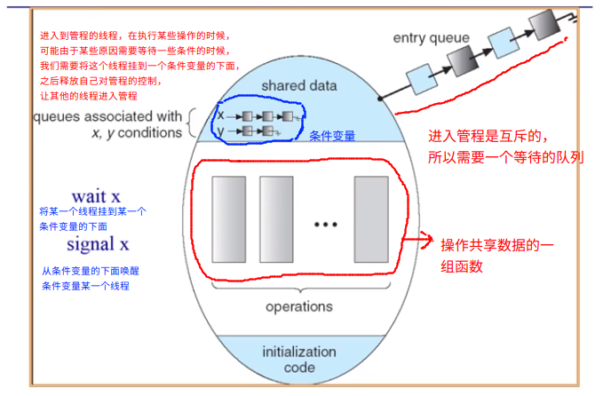

# 管程

> 管程的设计不是操作系统层面的，最初的设计是在编程语言层面的。

什么是管程？

> 包含了一系列的共享变量以及包含了操作这些变量的一系列的操作函数的组合

* 一个锁：指定临界区
* 0 个或者多个条件变量：等待/通知信号量用于管理并发访问共享数据

一般方法

* 收集在对象/模块中使用的相关的共享数据
* 定义方法来访问共享的数据



Lock

* ```Lock::Acquire()``` ---- 等待直到锁可以使用，可以进行抢占

* ```Lock::Release()``` ---- 释放锁，如果有等待的线程，就去进行唤醒线程

Condition Variables 

* ```Wait()``` :   如果正在占有管程的线程由于一些条件不能满足，需要等待条件，这个时候，他需要释放锁，并将自己挂在条件变量的链表下面，并使自己睡眠
* ```Signal()``` : 如果某些条件得到了满足，管程会去唤醒对应的条件变量的下面等待的线程

## 条件变量的实现

```c++
class Condition
{
    int numWaitting;
    WaitQueue q;
};

Condition::wait(lock)
{
    numWaitting++;
    Add this thread t into q;
    release(lock); // 需要释放掉自己的锁，让其他的线程可以去竞争锁
    schedule();  // need mutex; 选择下一个线程去执行,并让当前的线程睡眠
    require(lock); // 睡眠的线程唤醒之后，从这个地方开始执行，自动会去重新的竞争锁的控制权
}

Condition::signal()
{
    if (numWaitting > 0)
    {
        Remove a thread t from q;
        weakup(t);
        numWaitting --;
    }
}
```

### 使用管程来实现 消费者和生产者模型

```c++
class BoundBuffer
{
    .....
    Lock lock;
    int count = 0;
    Condition notFull, notEmpty;
};

BoundBuffer::Deposite(c)
{
    Lock.Acquire();
    while (count  == n)
        notFull.wait(&lock);
    Add C to the Buffer;
    count++;
    notEmpty.Signal(); // buffer 不是空的，此时去唤醒 notEmpty 队列中的线程。
    /***
     唤醒的操作存在一个问题，那就是当另一个线程被唤醒的时候，另一个线程会马上去竞争锁，但是锁的控制权还在当前的线程手中，当当前的线程执行了下面的这一条语句之后，退出了临界区。被唤醒的进程才有可能获取到锁
     这里就涉及到了两种唤醒执行的风格，一种就是Hansen风格，另一种就是 Hoare风格,后面会详细的讲解这两种机制，以及为何使用 while() 进行判断
    */
    lock.Release();
}

BoundBuffer::Remove(c)
{
    lock.Acquire();
    while (count == 0)
        notEmpty.wait(&lock);
    Remove c from buffer;
    count--;
    notFull.Signal(); // 唤醒队列中的线程，至于唤醒谁，有很多的策略，比方说，使用 FIFO 机制
    lock.Release();
}
```

### 唤醒操作的两种风格

#### Hansen-Style

* 当线程 A 发出了 signal() 之后，线程 B 被唤醒。但是 A 并不是马上释放自己锁，而是继续执行一些代码，之后在 Release （<font color=red>上面的伪码就是这种实现方式</font>）。
* 这种情况下， B 在 唤醒后，获得锁之后，需要重新判断（<font color=red>while 操作</font>）自己的条件是否满足(**因为第一你不确定 A 在执行了 signal() 之后又执行了什么，第二，在竞争锁的过程中，可能B 不是第一时间获得 A 释放的锁，可能中间有 线程 C 更改了临界区的数据，使得条件又不满足了**)
* 这种实现非常的高效

```c++
BoundBuffer::Deposite(c)
{
    Lock.Acquire();
    while (count  == n)
        notFull.wait(&lock);
    Add C to the Buffer;
    count++;
    notEmpty.Signal();
    lock.Release();
}
```

#### Hoare-Style

* 当线程 A 发出了 Signal() 之后，我们希望在 condition 上等待的线程可以马上进行执行（生产者生产了产品，消费者马上就来拿走）。这里让 A 进入休眠，马上执行 B 线程的操作。操作完之后回到 A
* 这时候不需要去重新判断条件是否满足，因为条件一定是满足的
* 实现起来非常的困难，现在的操作系统不使用这种方法

```c++
BoundBuffer::Deposite(c)
{
    Lock.Acquire();
    if (count  == n)
        notFull.wait(&lock);
    Add C to the Buffer;
    count++;
    notEmpty.Signal();
    lock.Release();
}
```


