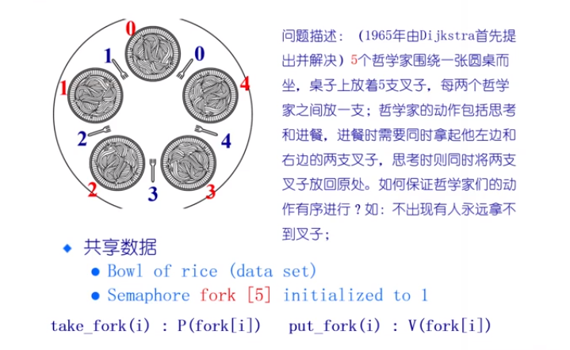

# 经典同步问题

## 读者写者问题

> 1. 一次只能有一个写者进行书写，进行写操作的时候，不允许写操作
> 2. 多个读者可以同时进行读操作
> 3. 在有线程进行读操作的时候，不允许写操作
> 4. 读者优先 -- 如果现在有读者在读，写操作到达的时候必须等待。如果这个时候又有读者到达，它可以跳过排在它前面的写者，开始进行读操作

### 共享数据

* 数据集
* 信号量  Rcount 表示有多少个读者在进行读，初始化为 0
* 信号量 countMutex 对 Rcount 进行上锁，初始化为 1
* 信号量 writeMutex 对数据集进行上锁，一次只能有一个写者进入到临界区当中, 初始化为 1

### 读者优先的情况

Writer:

```c++
sem_wait(writeMutex);  // p() 操作
write;
sem_post(writeMutex);  // v() 操作
```

Reader:

```c++
sem_wait(CountMutex);
if (Rcount == 0)
    sem_wait(writeMutex);
++Rcount;
sem_post(countMutex);

read;

sem_wait(countMutex);
--Rcount;
if (Rcount == 0)
    sem_post(writeMutex);
sem_post(countMutex);
```

### 写者优先

> 使用管程来实现写者优先

> 有读线程到达，它需要查看两件事。第一件事，当前拥有临界区的是否是写线程；当前的等待队列中是否有写线程。读线程需要等待在它们的后面

> 对于一个写线程，那么他需要查看当前占有临界区的是哪一个线程，是读线程还是写线程。只有临界区没有被占领的话，那么就可以去锁定临界区。

表示临界区的状态

```c++
AR = 0; // 处在活跃状态的读者的个数
AW = 0; // 处在活跃状态的写者的个数
WR = 0; // 处在等待状态的读者的个数
WW = 0； // 处在等待状态的写者的个数
Condition okToRead; // 现在可以去读了
Condition okToWrite; // 现在可以去写了
Lock lock;	// 锁定临界区
```

```c++
Database::startRead()
{
    lock.Acquire();
    while((AW + WW) > 0)	// 写者优先
    {
        WR++;
        okToRead.wait(&lock);
        WR--;
    }
    AR++;
    lock.Release();
}

Database::DoneRead()
{
    lock.Acquire();
    AR--;
    if (AR == 0 && WW > 0)
    {
        okToWrite.signal();
    }
    lock.Release();
}
```

```c++
Database::startWrite()
{
    lock.Acquire();
    while((AR + AW) > 0)
    {
        WW++;
        okToWrite.wait(&lock);
        WW--;
    }
    AW++;
    lock.Release();
}

Database::DoneWrite()
{
    lock.Acquire();
    AW--;
    if (WW > 0)
        okToWrite.signal();
    else if (WR > 0)
        okToRead.broadCast(); // 唤醒所有等待的读者线程，因为读可以多进程读
    
    lock.Release();
}
```

> 读线程和写线程的实现

```c++
Database::write()
{
    startWrite();
    // write database;
    // 注意在真正的写数据库的时候，这个线程并没有持有任何的锁，互斥的操作是通过设置了 AW 来保证没有其他的线程可以进来
    DoneWrite();
}
```

```c++
Database::read()
{
    startRead();
    // Read database;
    // 注意在读取数据库的时候，读线程不持有任何的锁，互斥的操作是通过设置了 AR 来保证其他的线程无法进入临界区
    DoneRead();
}
```

> 锁只用来保证对几种状态变量和条件变量的设定是互斥的，并不锁定读写的数据


## 哲学家就餐问题



一个哲学家进程可能的过程：

1. 思考中...
2. 进入了饥饿状态
3. 如果自己的左边或者右边都在进餐的话，进程就会进入阻塞的状态，如果左右两边都不在进餐的话，那么进入到第四步
4. 拿起两把叉子
5. 开始进餐
6. 放下左边的叉子，查看自己左边的邻座是否可以吃饭（处在饥饿的状态，并且左边的邻座两把叉子都在），那么就去唤醒左边的
7. 放下右边的叉子，查看自己右边的邻座是否可以吃饭（处在饥饿的状态，并且右边的邻座两把叉子都在），那么就去唤醒右边的
8. 又要开始思考了，进入到 1

> 在上面的解决方案中，每一个哲学家的状态成为了临界状态，而不是将叉子看成临界状态（将叉子看成临界状态存在者很多的问题）

```c++
#define THINKING	0
#define HUNGRY		1
#define EATING		2
int state[N];  // 每一个哲学家的状态信息
semaphore  mutex; // 临界区的互斥的访问过程，初始值为 1
semaphore  s[N]; // 一个哲学家在吃完了之后，可能需要去唤醒其他的哲学家,初始值都是 0 
```

```c++
void philosopher (int i)	// 第 i 个哲学家的进程过程
{
    while(ture)
    {
        think();	// 思考  THINKING 是一个临界资源，需要在保护下进行初始化
        take_fork(i);	// 拿起两把叉子，或者不拿叉子 ， （需要持有锁）
        eat();	// 吃饭
        put_fork(i);   // 放下叉子    （需要持有锁）
    }
}
```

```c++
void take_fork(i)
{
    mutex.P();
    state[i] = HUNGRY;  // 状态从 THINKING 变为 HUNGRY
    test_take_left_right_fork(i);
    mutex.V();
    s[i].P(); // 如果在 test_take_left_right_fork(i) 中拿到了两把钥匙，那么这个时候的 s[i] == 1,自然在这里执行 P() 操作的时候是不会把阻塞，自然可以开始进行吃饭。如果在 test_take_left_right_fork(i) 中没有拿到钥匙，那么 s[i] == 0,那么在执行 P() 操作的时候，那么这里就会被阻塞，即无法进行吃饭
}

void test_take_left_right_fork(i)
{
    if (state[i] == HUNGRY && state[LEFT] != EATING && state[RIGHT] != EATING)
    {
        state[i] = EATING;	// 两把叉子到手
        s[i].V();	// 通知 i 可以吃饭了，值变为了 0 
    }
}
```

```c++
void put_fork(i)
{
    mutex.P();
    state[i] = THINKING;
    test_take_left_right_fork(LEFT); // 可能会唤醒左边的人开始吃饭
    test_take_left_right_fork(RIGHT); // 可能父会唤醒右边的人开始吃饭
    mutex.V();
}
```

