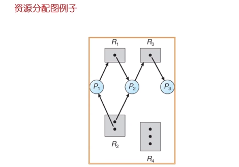
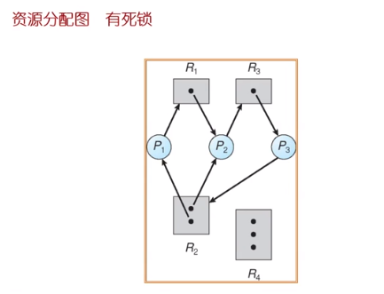
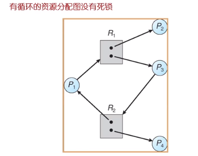
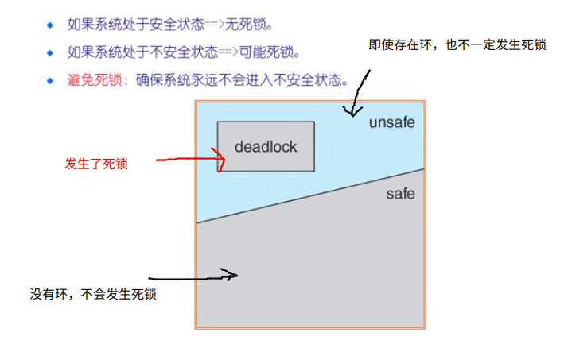
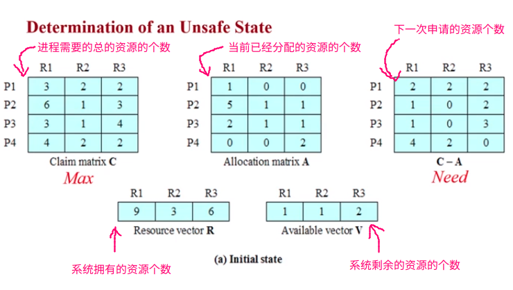
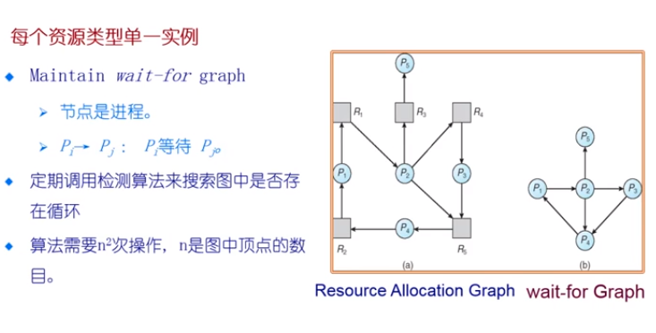
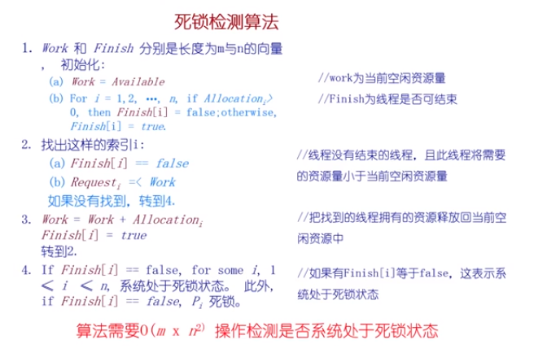

# 死锁问题

可以重复使用的资源

* 在一个时间段内部只有一个进程可以访问相应的资源并且不可以删除资源
* 进程获得自资源后，需要在使用之后释放资源让其他的进程使用
* 处理器，I/O, 存储器，设备和数据结构，文件，数据库，信号量
* 如果一个进程已经拥有了一个资源，但是还想要请求其他的资源，就有可能发生死锁

使用资源

* 创建和销毁资源
* 在 I/O 缓冲区的中断，信号，消息，信息
* 如果接收消息阻塞，可能会发生死锁
* 可能少见的组合事件会引起死锁

## 资源分配图

> 一组边  $E$  和  顶点  $V$  的集合

$V$ 有两种类型：

* 系统中的进程的集合  $P = \{ P_1, P_2, ..., P_n \}$
* 系统中资源的集合 $R = \{ R_1, R_2, ..., R_n\}$



> $P_1$ 当前拥有 $R_2$ 的一个资源，并且请求了 $R_1$ 的一个资源。
>
> $P_2$ 当前拥有 $R_1$ 的资源和一个 $R_2$ 的资源，并且请求 $R_3$ 的一个资源
>
> $P_3$ 当前拥有 $R_3$ 的资源



> 图中存在着有向环



* 如果图中没有循环  $\rightarrow$ 不会死锁
* 如果图中有环
  * 如果每一个资源类只有一个实例，就会死锁
  * 如果每一个资源类有多个实例，可能会死锁

## 死锁特征

在下面的四个条件同时成立的时候，就有<font color=red>可能会发生死锁</font>

* 互斥：在一个时间只能有一个进程使用资源
* 持有并等待：进程至少持有一个资源正在等待获取其他进程持有的额外资源
* 无抢占：一个资源只能被进程自愿的释放，进程在完成自己的任务之后释放相关的资源
* 循环等待：存在等待进程集合 ${\{ P_0, P_1, ...., P_N \}}$ ,$P_0$ 正在等待 $P_1$ 的资源，$P_1$ 在等待 $P_2$ 的资源， ....， $P_N$ 在等待 $P_1$ 的资源

## 死锁的处理方法

> 确保资源永远不会进入死锁状态(极大的限制了操作系统的功能)
>
> 运行系统进入死锁状态，然后恢复
>
> 忽略这个问题，假装系统中从来没有发生死锁，用于大多数的操作系统，包括 Unix（死锁判断的开销非常的高，会极大的影响操作系统的效率）


### 死锁的预防和死锁的避免

#### 预防 --- 采用一定的方式，让死锁不会发生

> 死锁的出现的四个必要条件在上面的 **死锁的特征** 当中进行了介绍，如果我们可以打破这四个条件中的某一个或者某几个，那么就不会发生死锁了

* 互斥：共享资源不是必须的，必须占用非共享的资源

* 占用并等待：必须保证当一个进程请求的资源，它不持有任何其他资源

  *  打破这个条件的方法 ： 一个进程要么获取到它需要的所有的资源，要么就不要任何的资源，进行睡眠

    这个方法的问题就是，资源的利用率低，可能会出现饥饿问题

* 无抢占

  * 如果进程栈由某些资源，并请求它目前还没有得到的资源，则释放当前正在占有的资源
  * 被抢占的资源添加到资源列表当中
  * 只有当它能够获得旧的资源以及它请求新的资源，进程可以得到执行

* 循环等待

  * 对所有的资源类型进行排序，并要求每一个进程按照资源的顺序进行申请（在通用操作系统当中使用的不多，但是在嵌入式操作系统当中使用的比较的多，因为嵌入式操作系统当中的资源的类型比较的有限）

#### 避免 --- 让死锁可以化解

操作系统根据一些额外的信息，来进行推理。

* 当一个进程在需要申请资源的时候，操作系统判断申请的资源是否合理。所谓的是否合理，就是操作系统需要进行一定的推断，来判断进程在申请这个资源的时候，是否会发生死锁。如果申请的资源不合理，那么即使操作系统拥有相应的资源，操作系统也不会提供相应的资源

* 操作系统要求进程声明自己可能需要的每种类型的资源的最大的数目
* 资源的分配状态是通过限定提供与分配资源的数量，和进程的最大需求
* 死锁避免算法动态检查资源的分配状态，以确保永远不会出现环形等待（有环不一定代表着死锁的状态）的状态


> 当一个进程请求可用资源，系统必须判断立即分配是否能使系统处于安全状态

安全状态 ： 针对所有的进程，存在安全序列

* 时间序列 ${<P_1, P_2, ...., P_N>}$ 是安全的：针对每一个 $P_i$ ，$P_i$ 要求的资源能够由当前可用的资源 + 所有的 $P_j$ 持有的资源来满足， 其中 $j < i$

* 如果 $P_i$ 资源的需求不是立即可用的，那么 $P_i$ 可以等到所有的 $P_j$ 完成
* 当 $P_i$ 执行完毕的时候， $P_{i+1}$可以得到所需要的资源（$P_1, P_2, ..., P_i$ 所使用的所有的资源），并进行执行



## 银行家算法 --- Banker's Algorithm

### 前提条件

> 有多个进程和多个资源的实例
>
> 每一个进程都必须能最大限度地利用资源
>
> 当一个进程请求一个资源，就不得不等待
>
> 当一个进程获得所有的资源就必须在一段有限的时间释放这些资源

### 银行家算法的数据结构

n = 进程的数量

m = 资源类型的数量

Max(总需求量) ：$n \times m$ 的矩阵。如果 $Max[i,j] = k$,表示进程 $P_i$ 最多请求 $R_j$ 类型的资源的数量

Available(剩余空闲量)  ：长度为 $m$ 的向量。 如果 $Avaiable[j] = k$, 有 $k$ 个类型 $R_j$ 的资源可以使用

Allocation (已分配的量) : $n \times m$ 的矩阵，如果 $Allocation[i,j] = k$, 则 $P_i$ 当前分配了 $k$ 个$R_j$ 类型资源的实例

Need (未来的需要量) ： $n \times m$ 的矩阵，如果 $Need[i,j] = k$ ，则 $P_i$ 可能需要至少 $k$ 个 $R_j$ 类型的实例


$$
Need[i,j]  = Max[i,j] - Allocation[i,j]
$$

### Safety State Estimating Algorithm

1. Work 和 Finish 分别是长度为 m 和 n 的向量

初始化：

```c++
Work = Available;    // 当前的资源剩余的空闲量
Finish[i] = fase for i = 1, 2,... n; // 线程 i 还没有结束
```

2. 找到这样的 $i$:
   * Finish[i] = false
   * $Need_{i} \leq Work$ : 进程 $P_i$ 所还需要的所有的资源都可以得到满足，那么这个进程就可以占有资源，并开始执行，并且可以在有限的时间内执行完毕

没找到这样的 $i$, 那么转到 4

3. 
   * $Work = Work  + Allocation_{i}$  : 进程 i 的资源需求量小于当前剩余空间资源量，所以配置给他再进行回收
   * Finish[i] = true;
   * 转到 2

4. 

```c++
if (Finish[i] == true for all i)
    then the system is in a safe state
```


### Banker's Algorithm 

初始化：$Request_{i}$ 表示的是进程 $P_i$ 当前所需要的资源的向量。如果 $Request_{i}[j] = k$，表示进程 $P_i$ 需要 $R_j$ 类型的资源 $k$ 个。

while :  

1. 如果 $Request_{i} \leq Need_{i}$ 转到步骤 2。否则的话，提出错误条件，因为进程已经超出了其<font color=red>最大要求</font>
2. 如果 $Request_{i} \leq Available$  ，转到步骤3。否则的话，$P_i$ 必须要等待，因为资源不可用
3. 假装给 $P_i$ 分配同所需要的资源； // 生成一个需要判断状态是否安全的资源分配环境

$$
Available = Available - Request_{i};	\\
Allocation_{i} = Allocation_{i} + Request_{i}; \\
Need_{i} = Need_{i} - Request_{i};
$$



### 死锁检测和死锁恢复

> 允许系统进入死锁状态
>
> 死锁检测算法
>
> 恢复机制

#### 方法

将一个资源等待图简化为一个等待图，在等待图中查看是否有环。如果图中有环，那么我们就认为存在死锁



#### 死锁检测算法



* 复杂度非常的高，在实际的操作系统中没有使用这种算法的
* 一个程序需要的资源的数目实际上是很难得到的，所以这种算法很难进行实现

* 可以用于操作系统和应用程序的调试的过程


发生死锁之后应该怎么做？

* 终止所有的死锁进程
* 在一个时间内终止一个进程直到死锁消除
* 终止进程的顺序应该是
  * 进程的优先级
  * 进程占用的资源的大小
  * 有多少进程需要被终止
  * 进程是交互的还是批处理的

> <font color=red>现在的通用操作系统往往采用的都是鸵鸟算法，就是不去管是否会发生死锁。如果发生了死锁要么杀死进程，要么 reboot</font>

