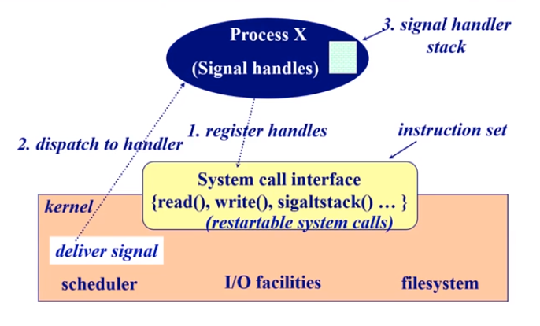
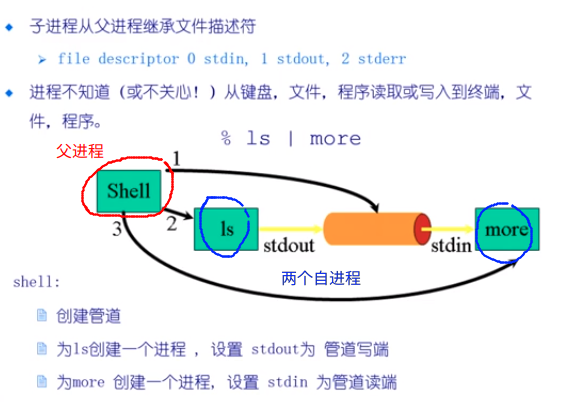
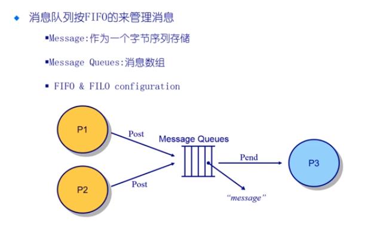
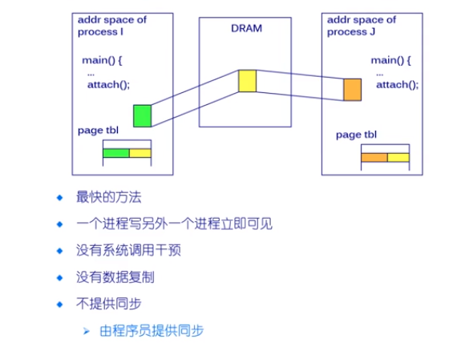

# 信号,管道,消息队列,共享内存

队列的消息被附加到链路,可以是以下的 3 种方式之一:

1. 0 容量 ---- 0 messages    发送方必须接收等待方
2. 有限容量 ---- n messages 的有限的长度   如果队列是满的话,发送端必须进行等待
3. 无限容量 --- 无限长度   发送方不需要等待

## 信号(Signal)

* 软件中断通知事件处理
* 例子: SIGFPE, SIGKILL, SIGUSR1 SIGTOP, SIGCONT

接收到信号时会发生什么

* catch : 指定信号处理函数被调用
* Ignore : 依靠操作系统的默认的操作
* Mask : 闭塞信号因此不会传送



1. 应用程序如果希望可以处理某一种类型的信号的时候，需要在应用程序开始的地方注册这个信号的处理函数，将这个处理函数发送给操作系统，操作系统就知道在应用程序收到信号的时候，应该调用哪一个处理函数

2. 在信号发生的时候，操作系统如何打断当前的应用程序的正常的执行，转而去执行处理函数？

3. 信号不能完成信息的传递


## 管道

子进程从父进程继承文件描述符

* file descriptor 0 stdin, 1 stdout, 2 stderr

进程不知道从键盘，文件，程序读取或写入到终端，文件，程序



> 1. 管道的使用，父进程帮助子进程们完成了管道的建立的过程，在上面的例子 ```ls |more``` 的例子当中， Shell 帮助两个子进程 ```ls```,和 ```more``` 建立了 管道缓冲区，虽然 ls 的输出到标准输入输出，在这里被操作系统定位到 管道的 buffer 当中； more 的默认的输入时 标准输入输出，在这里也被定位到了 管道的 buffer 当中；
>
> 2. ```ls``` 和 ```more``` 并不知道自己是从 buffer 当中写入/读取数据的，以为自己是从标准输入输出写入/读取的数据
> 3. 如果没有父进程建立管道，子进程之间或者子进程和父进程之间无法完成管道的通信
> 4. 进程之间没有父子关系的话,那么管道就没有办法进行实现了
> 5. 管道中传输的时字节流的数据,没有结构化的表示形式(当然你可以在应用程序当中对字节流进行结构化过程,但是处理很复杂)
> 6. Buffer 的大小是有大小的限制的,如果buffer 满,就会发生阻塞

## 消息队列

消息队列按照 FIFO 来管理消息

* Message: 作为一个字节序列存储
* Message Queues: 消息数组
* FIFO & FILO configuration



## 共享内存

进程

* 每个进程有自己的私有的地址空间
* 在各个进程之间,设置一个公共的内存区域,所有的进程可以公用这个区域(共享内存段)

优点

* 快速,方便的共享数据

缺点

* 要保证同步数据访问(写冲突)



* 注意每个进程都拥有自己的页表,页表完成了进程的逻辑地址空间当实际的物理地址的映射,如果我们在两个进程中,将两个进程中的两个逻辑地址映射到同一个物理地址空间,就完成了物理内存的共享
* 需要操作系统的支持

## Socket 机制

