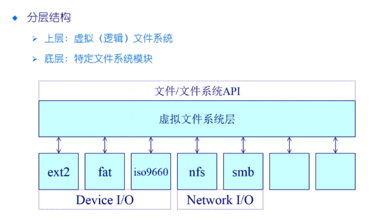
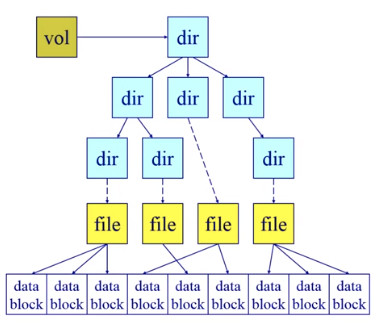
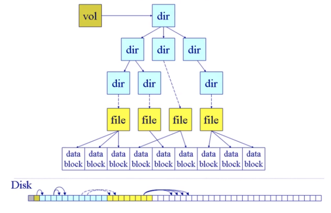

# 虚拟文件系统

分层结构

* 上层：虚拟（逻辑）文件系统
* 底层：特定文件系统模块

目的：

* 对所有不同文件系统的抽象

功能：

* 提供统一的文件和文件系统接口
* 管理所有文件和文件系统关联的数据结构
* 高效的查询和遍历
* 与特定文件系统模块的交互

虚拟文件系统不存在我们的磁盘当中，而是操作系统的一部分，在操作系统启动之后，会自动的创建虚拟文件系统

> 对于一个基本的文件系统来说，它需要一个一个总控的数据，用来表征文件系统的特征

### 超级块（卷控制块）Superblock

* 每一个文件系统一个
* 文件系统的详细信息
* 块，块大小，空余块，计数/指针等

### 文件控制块（vnode, inode）

* 每一个文件一个
* 文件的详细信息
* 许可，拥有着，大小，数据库位置

### 目录节点（dentry）

* 每个目录项一个
* 指向文件控制块，父节点，项目列表等

> 上面的所有的数据结构都存储在磁盘上面，在磁盘中的特定的区域会保存上面的这些结构信息

文件系统数据结构

* 卷控制块（每一个文件系统一个）
* 文件控制块（每一个文件一个）
* 目录节点（每个目录项一个）

固化在二级存储当中

当需要的时候加载进入内存

* 卷控制块：当文件系统挂载的时候进入内存
* 文件控制块：当文件被访问的时候载入内存
* 目录节点：在遍历一个文件路径的时候进入内存

