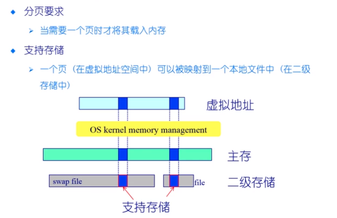
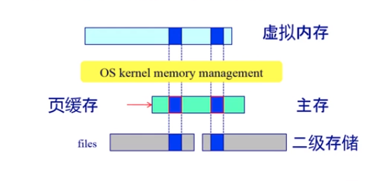

# 数据缓存

> 硬盘的访问的速度比我们的内存的访问的速度相差了几个量级，那么为了提高数据的访问的速度，我们会将一些经常访问的数据缓存在内存当中。

## 数据块缓存的方式

数据块按需读入内存

* 提供 read() 操作
* 预读
* 延迟写：内存中的数据发生了修改并不是马上写回磁盘，减小磁盘的开销

数据块使用后进行缓存

* 假设数据将会被再次使用
* 写操作可能被缓存和延迟写入（减少写磁盘的次数）

两种数据块的缓存的方式

* 普通缓冲区缓存
* 页缓存：统一缓存数据块和内存块（内存中的页的大小和磁盘的块的大小不同）

## 分页的缓存机制

为了和前面的内存管理相结合，我们希望可以页的大小来进行文件数据的缓存（这样的话，文件可以更好的为上层的应用程序进行使用）

> 将文件系统和内存管理系统进行集合，将文件数据映射到内存当中，实现高效的文件访问

## 文件的缓存算法

* 在虚拟内存中文件数据块被映射成页
* 文件的读/写操作被转换为对内存的访问
* 可能导致缺页  / 或者设置为脏页

