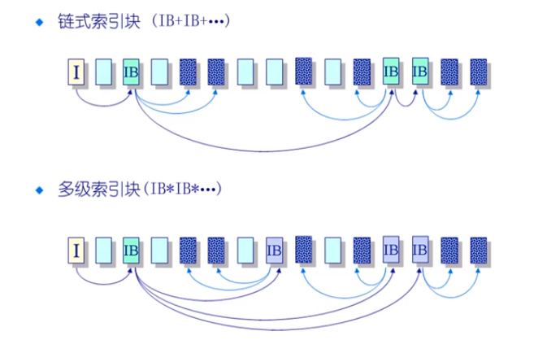
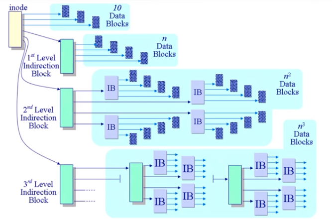

# 文件分配

> 文件会由写操作，文件的内容可能会增加也有可能会减小，那么对于文件的大小的改变，如何组织其在磁盘中的如何进行存储？
>
> 文件的大小各异，有非常大的文件也有非常小的文件，如何保证对于大文件和小文件的访问都可以同样的高效？

大多数的文件都很小

* 需要对于小文件有好的支持
* 块空间的大小不能太大

一些文件比较的大

## 分配方式

* 连续分配
* 链式分配
* 索引分配

### 连续分配

文件头指定起始块和长度

位置/分配策略

* 最先匹配，最佳匹配

优势

* 文件读取表现好
* 高效的顺序和随机访问

劣势：

* 碎片
* 如果要添加，删除，增长可能需要移动大量的数据，开销很大

> 对于只读的文件系统效果很好

### 链式分配

文件以数据块链表方式存储

文件头包含了到第一块和最后一块的指针

优点：

* 创建，增大，缩小很容易
* 没有碎片

缺点

* 不可能进行真正的随机访问（必须先访问前面的数据块，才能访问后面的数据块）

* 可靠性差（如果有链遭到了破坏，数据会发生大范围的丢失）

### 索引分配

为每一个文件创建一个名为索引数据块的非数据块，每一个索引项指向文件的一个数据库，每一个索引保存了文件的一个数据块的存储的位置

文件头包含了索引数据块

优点：

* 创建，增大，缩小很容易
* 没有碎片
* 支持直接访问

缺点：

* 当文件的内容很小，存储索引的开销相对就会很大（索引大小和文件的大小可能差不多）
* 非常大的文件，一个索引块无法存储下文件的所有的数据块的位置

### 对大文件的索引分配

多级索引

### 早期 Unix 的文件管理中的多级索引块

文件头中包含了 13 个指针

* 10 个指针指向数据块
* 第 11 个指针指向间接数据块
* 第 12 个指针指向二重间接数据块
* 第 13 个指针指向3重间接数据块

影响：

* 提高了文件大小限制的阈值
* 动态分配数据块，文件的扩展很容易
* 小文件的开销很小
* 只为大文件分配间接数据块，大文件在访问间接数据块是需要大量的查询的

