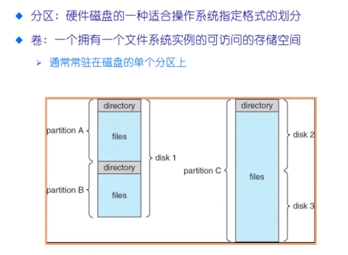
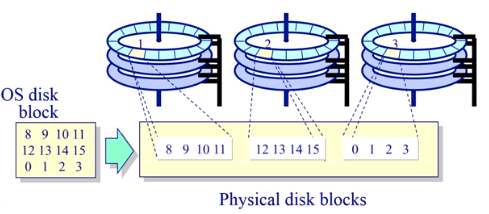
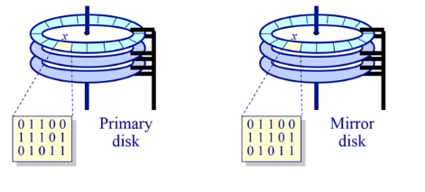
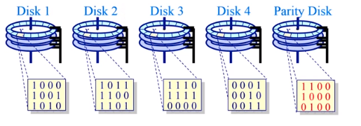

# 多磁盘管理

通常磁盘通过分区来最大限度减小寻道的事件

分区：一个磁盘可以分为不同的分区，不同的分区由不同的文件系统组成

卷：把多个硬盘资源看成一个卷来进行管理，我们可以把一个文件系统扩展到多个磁盘当中

使用多个并行磁盘来增加

* 吞吐量（并行）
* 可靠性和可用性（通过冗余）

RAID -- 冗余磁盘阵列

### 提高读取的速度

数据块分为多个子块，存储在独立的磁盘当中

通过更大的有效块大小来提供更大的磁盘带宽

## 提高可靠性

将相同的数据写入到两个磁盘当中，读取的过程从其中的任意一个硬盘中读取

## 结合上面的两个特点

多个数据盘拥有一个专用的奇偶校验磁盘，使用纠错码的方式来对多个数据盘上的数据进行编码。当磁盘阵列当中有少数磁盘发生故障的时候，可以通过纠错码来进行恢复

> parity disk 的读写的过程将会非常的频繁，它就变成了这个磁盘阵列的性能的瓶颈
>
> parity disk 容易出错

我们希望可以将 Parity Disk 的校验部分摊到每一个磁盘当中，这样校验磁盘的开销就可以分摊到每一个磁盘当中

## RAID-5 

把奇偶校验的块均匀的分布在每一个硬盘当中，即保证了可靠性，也提高了效率

奇偶校验的单位 byte-by-byte 或者 bit-by-bit

* RAID-0/4/5  block-wise
* RAID-3 : bit-wise

