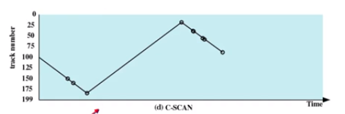

# 磁盘调度

读取或者写入时，磁头必须被定位在期望的磁道，并从期望的扇区开始

寻道时间

* 定位到期望的磁道所花费的时间

旋转延迟

* 在磁道中到达指定的扇区所需要花费的时间

* 平均的旋转延迟 = 磁盘旋转一周的时间 / 2

> 寻道花费了大部分的访问时间
>
> 寻道时间是造成了性能上的区别
>
> 对于单个磁盘，会有一个 I/O 的请求数目
>
> 如果请求是随机的，那么会表现很差

## 先进先出的方式

* 按照顺序进行处理请求
* 公平对待所有的进程
* 在进程很多的情况下，接近随机调度的性能

> 一般情况下，这个方法的性能很差

## 最短服务优先

选择从磁臂当前位置需要移动的距离最少的那个 IO 请求

总是选择最短寻道时间

## SCAN 方法

磁臂在一个方向上移动，直到磁臂到达给方向上最后的磁道

调换方向

有时候被称为  elevator algorithm 

### SCAN 进一步的优化 C-SCAN

限制只在一个方向上进行扫描（当磁头从低位置上向高位置进行移动，移动的过程中完成读写），在到达最高位置的时候不再逐渐从高位置到低位置进行扫描，而是直接回到最低位置，重新从低位置进行扫描

### C-SCAN 的进一步优化  C-LOOK

磁盘到达该方向上最后一个请求处（不到达最高位置），然后立刻反转

## N-step_SCAN

如果在某一个磁道上面的读取的请求过于的频繁，那么可能会出现，磁臂长时间在某一个磁道读取，而不发生移动，这种现象被称之为磁臂粘着现象。

N-step_SCAN 算法将请求队列分为若干个长度为 N 的队列，磁盘调度按照 FCFS 算法在这些子队列中进行处理。每次处理一个队列的时候又是按照 SCAN 进行处理。新到达的请求放在新的队列当中

## FSCAN

FSCAN 将 N-step-SCAN 中的 N 限定为 2

一个正在执行的队列，一个等待队列

## 特例

上面的算法对于 SSD 的硬盘没有作用

对于现代的一些硬盘，自身硬件就有比较智能的调度的算法，操作系统中进行的算法的优化可能不会有任何的作用

