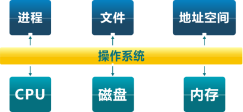
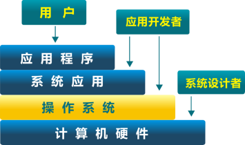
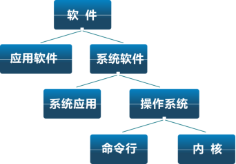
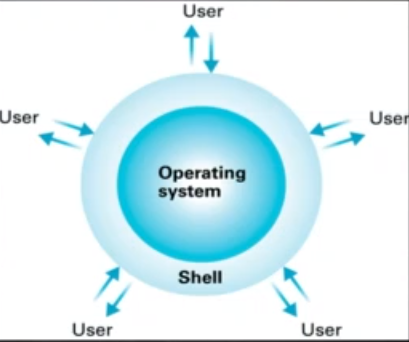

# 什么是操作系统？

## 操作系统定义

* 没有精确的定义
* 从用户的角度，操作系统是一种控制程序
  * 管理应用程序
  * 为应用程序提供服务（提供声卡，网卡等资源的访问）
  * 杀死应用程序
* 从计算机内部对象的角度，操作系统是一个资源的管理器
  * 应用程序与硬件之间的中间层
  * 管理各种计算机软硬件资源
  * 提供访问计算机软硬件资源的高效手段
  * 解决资源访问冲突，确保资源公平使用

* 操作系统层次结构
  * 硬件之上
  * 应用程序之下

## 软件

* 应用软件：办公软件，视频播放软件
* 操作系统位于应用软件之下，为应用软件提供服务支撑

操作系统层面的软件我们又可以将其分为两个部分：一个部分是面向我们的用户，我们称之为 Shell。另一部分面向我们计算机的内部，将计算机内部的资源管理起来，我们称之为 Kernel。

> 这个课程中主要学习的部分是 kernel，而不是 shell。操作系统通过 shell 向用户提供了一系列的可见的服务，本课程学习 kernel 中操作系统完成的用户所不可见的操作，即操作系统内核是如何管理计算机资源，如何控制程序。

* shell
  * 一方面是包含有 GUI 界面的系统软件程序，我们可以通过一些点击，输入操作完成相应的功能，这些功能是操作系统提供给用户的接口，方便用户管理我们的计算机
  * 另一方面是在 UNIX 下使用很频繁的 命令行窗口，通过在窗口中输入相应的字符完成相应的功能

## 硬件资源

* **CPU**
* **内存**
* **磁盘**
* （声卡，网卡，显卡 ...）

如果我们以上面的几种硬件资源来看，那么操作系统的内核需要有下面的一些功能：

* CPU 的调度，进程和线程的管理
* 物理内存的管理
* 虚拟内存的管理（虚拟内存为每一个应用程序提供了一个相对独立，尽可能大的内存空间使用）
* 文件系统管理
* 中断处理和（IO）设备驱动

## OS Kernel 特征

* 并发
  * 计算机系统当中同时存在多个运行的程序，需要 OS 的调度和管理

> 并发：在一个时间段内，有多个程序可以运行，这个时间段的长度可长可短
>
> 并行：在同一个时间点上，有多个程序可以运行。（要求我们的计算机具有多个CPU,这样，操作系统才有可能在同一个时间，在不同的CPU上同时执行不同的程序）

* 共享
  * “同时”访问
  * 互斥共享
* 虚拟
  * 利用多道程序设计技术，让每一个用户都觉得有一个计算机专门为它服务

> 操作系统直接面向硬件，它将硬件进行了虚拟化。操作系统将CPU虚拟化为进程，将磁盘虚拟化为文件系统，将内存虚拟化为地址空间。

* 异步
  * 程序的执行不是一贯到底的，而是走走停停，向前推进的速度不可预知
  * 但是只要运行的环境相同，OS 就要保证程序运行的结果也要相同

