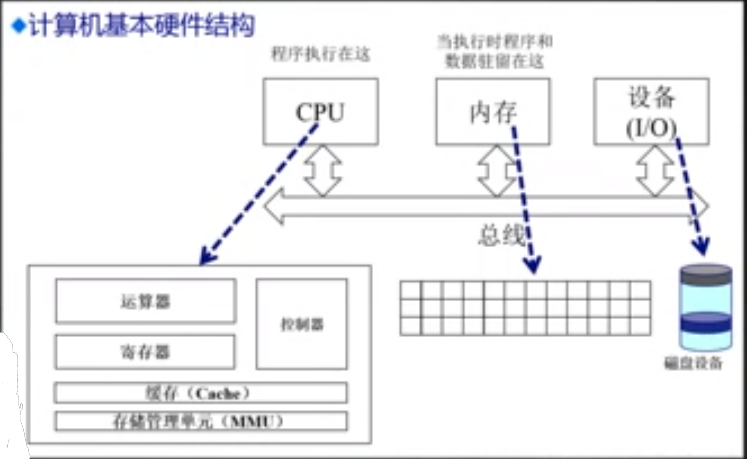
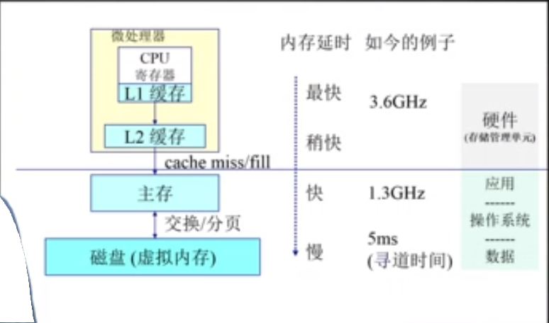
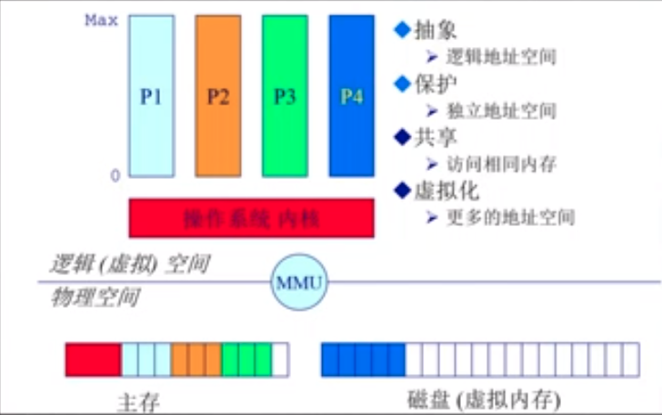

# 计算机体系结构及内存分层体系

* 计算机体系结构/内存分层体系
* 地址空间 & 地址生成
* 连续内存分配

## 计算机体系结构/内存分层体系

* 计算机体系结构
* 内存分层体系
* 操作系统的内存管理范例

### 内存的层次结构

* cache 位于处理器的内部，其容量十分的小，但是速度非常的快，其由处理器直接进行操作，操作系统无法直接对其进行处理

## 操作系统物理内存管理

* 抽象
  * **逻辑地址空间**
  * 我们希望我们的应用程序在访问内存的时候，不需要知道内存的细节，不需要考虑物理内存在什么地方，不需要考虑IO 在什么地方。它只需要访问一个连续的地址空间就可以了
* 保护
  * **独立的地址空间**
  * 我们的操作系统可以同时运行多个应用程序，因此有可能会发生一个进程访问另一个进程的地址空间，可能会破坏另一个进程的地址空间。因此我们不同的进程之间的内存空间需要进行隔离。隔离的实现由操作系统进行管理
* 共享
  * **访问相同的内存**
  * 进程之间需要进行隔离，但是某些进程之间可能需要进行交互。操作系统必须提供一种高效，安全的数据传递的机制
* 虚拟化
  * 更多的地址空间
  * 如果我们的内存的空间不够大，另外运行在计算机上的应用程序过多，将会导致我们的物理内存不够用。操作系统需要提供一种机制，将不经常使用的程序暂时存储到我们的磁盘当中，物理内存中只存储重要的，频繁使用的应用程序

## 在操作系统中管理内存的不同的方法

* 程序重定位
* 分段
* 分页
* 虚拟内存
* 按需分配虚拟内存

## 内存管理的实现高度的依赖硬件

* 必须知道内存的架构
* MMU(内存管理单元)：硬件组件负责处理 CPU 的内存访问请求

