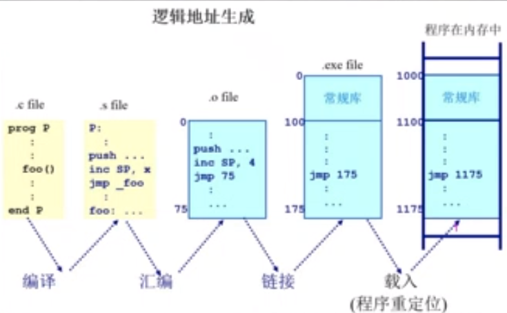

# 地址空间与地址生成

* 地址空间的定义
* 地址的生成
* 地址安全检查

## 地址空间


* 物理地址空间 -- 硬件支持的地址空间
  * 起始地址0 ，到地址 ${max_{sys}}$
* 逻辑地址空间 --  一个应用程序所拥有的内存范围
  * 起始地址 0，到地址 ${max_{prog}}$
  * 一个应用程序所 "看" 到的地址空间
  * 操作系统需要管理逻辑地址空间和物理地址空间之间的映射关系

## 逻辑地址生成



* 从 ```.c``` 文件编译位 ```.s``` 的汇编文件的过程，函数，变量还依然使用符号来进行表示
* 在汇编过程中从 ```.s``` 文件生成 ```.o``` 的目标文件，符号地址都转换为逻辑地址（从0 开始的偏移量）
* 我们需要将多个目标文件链接为一个目标文件，每个目标文件中的逻辑地址之间可能有冲突，所以我们需要链接器进行处理，得到统一的逻辑地址。这个程序目前还只是存储在硬盘当中的程序，还没有加载到内存中进行执行
* 当我们的硬盘中的程序加载到我们的内存当中，这个加载的过程中可能会有逻辑地址的一些调整

> 这些程序的逻辑地址的确定，不需要我们的操作系统的参与，通过我们的程序，编译器，链接器，和 loader 的帮助就可以完成

## 物理地址的生成


> 在CPU 想要执行一条指令的时候，就需要将我们的逻辑地址转换为物理地址

* CPU 方面
  1. 运算器需要逻辑地址的内存的内容
  2. 内存管理单元 ```MMU``` 寻找在逻辑地址和物理地址之间的映射
  3. 控制器从总线发送在物理地址的内存内容的请求
* 内存方面
  4. 内存在收到请求之后，将相应的内存空间的内容通过总线发送给 CPU 
* 操作系统方面
  * 操作系统需要在前面四步执行之前，完成对逻辑地址到物理地址的映射关系

## 内存异常

> 操作系统还需要保证不同的程序之间的数据不可以相互干扰，因此操作系统要求每一个应用程序地址空间的访问是合法的，是限制在操作系统的约束范围只内的