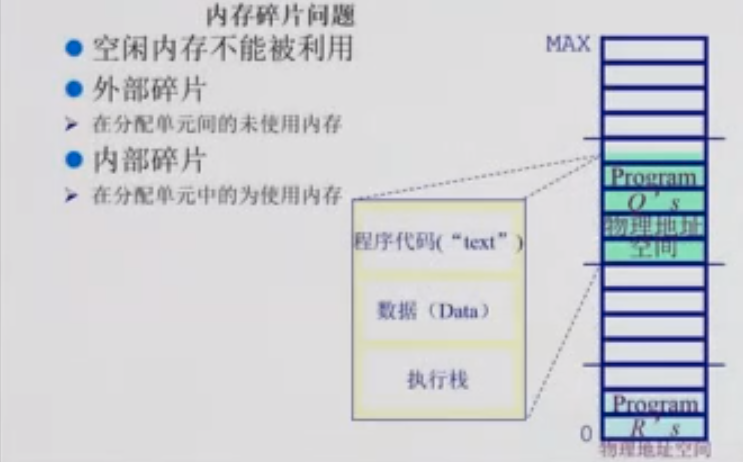
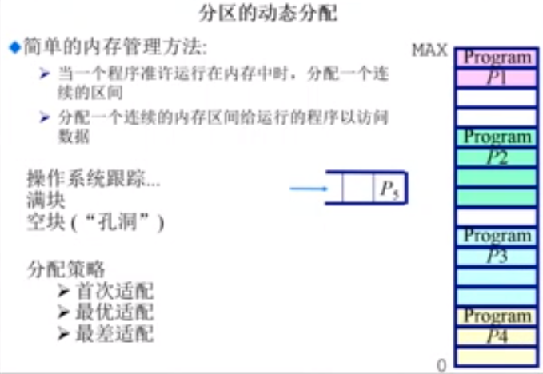
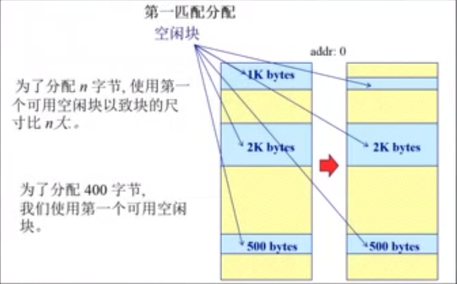
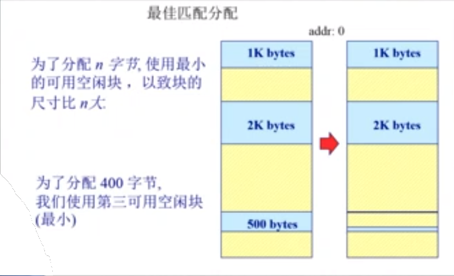
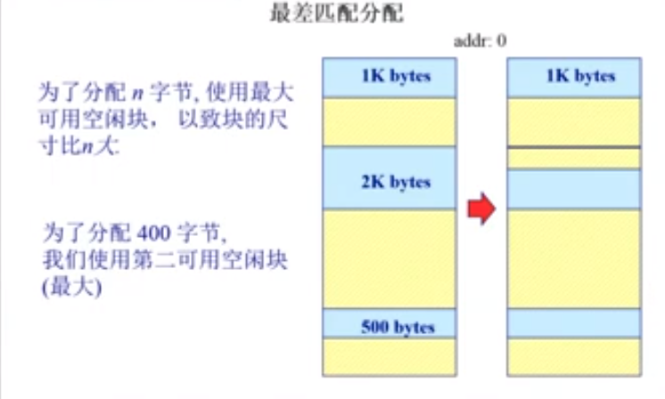

# 连续内存分配：内存碎片与分区的动态分配

* 内存碎片问题
* 分区的动态分配

  * 第一适配
  * 最佳适配
  * 最差适配
*   压缩式碎片整理
*   交换式碎片整理

## 内存碎片的问题

* 空闲内存不能被利用
* 外部碎片
  * 在分配单元间的未使用的内存
* 内部碎片
  * 在分配单元中未使用的内存

## 分区的动态分配

> 当我们的程序加载到我们的操作系统的时候，操作系统需要在物理内存中找到一段连续的内存空间给应用程序，让应用程序可以跑起来

> 在应用程序运行的过程中，应用程序需要访问一些数据，这些数据也需要分配内存空间。操作系统也要保证在应用程序请求内存的时候，可以分配一段连续的空间

### 首次适配

 

####  基本原理和实现

* 简单实现
* 需求：
  * 按地址排序的空闲块的列表
  * 分配需要寻找一个合适的分区
  * 重分配需要检查（回收的过程），看是否自由分区能够合并于相邻的空闲分区（若有）

* 优势
  * 简单
  * 易于产生更大的空闲块,向着地址空间的结尾
* 劣势
  * 外部碎片（每个使用的内存的中间可能夹杂着一些非常小的空闲块，由于这些空闲块非常的小，被使用的概率就不大）
  * 不确定性

### 最优适配

#### 基本原理和实现

* 为了避免分割大的空闲块
* 为了最小化外部碎片产生的尺寸
* 需求：
  * 按照尺寸大小排列的空闲块的列表
  * 分配需要找到一个合适的分区
  * 重分配需要搜索及合并邻近的空闲的分块(如果有)
* 优势
  * 当大部分的分配都是小尺寸的时候，非常的高效
  * 比较简单
* 劣势
  * 外部碎片(将外部碎片拆开比较的细，导致这些外部碎片被使用的可能性比较的小)
  * 重分配慢
  * 容易产生很多的没有用的微小的碎片

### 最差适配（Worstest Fit ）

#### 基本原理和实现

* 为了避免有太多的微小的块
* 需求
  * 按照尺寸来排序的空闲块的列表
  * 分配很快（获得最大的分区）
  * 重分配需要合并相邻的空闲的空间（如果有的话）
* 优势：
  * 如果分配的是中等尺寸的效果最好
* 劣势
  * 重分配 慢
  * 外部碎片
  * 易于破碎大的空闲块以至于大的分区无法被分配到

> 应用程序的请求是随机发生的，有时候需要大的内存，有的需要小的内存，所以上面的三种分配的方法没有哪一种可以解决所有的问题

