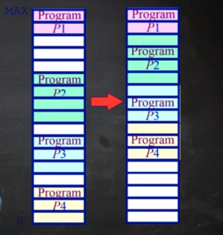
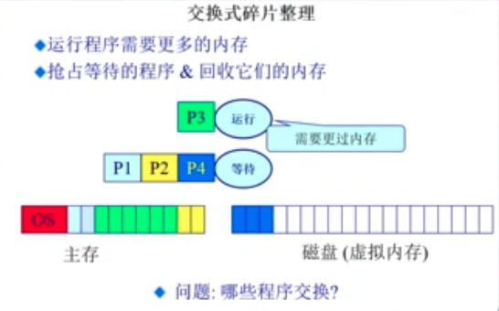

# 连续内存分配：压缩式和交换式碎片整理

## 压缩式碎片整理

* 重置程序以合并孔洞（内存中运行的程序可以改变它的位置）
* 要求所有的程序是动态可重置的
* 议题：
  * 何时重置？
  * 开销？

> 我们在什么时候进行程序块的移动，显然在程序正在执行的时候进行移动是不行的。那么在应用程序在等待事件的过程中，阻塞的过程中，可以进行移动。如果进行大量的移动的操作，依然是一个非常耗时的工作。

## 交换式内存整理

* 运行程序需要更多的内存
* 抢占等待的程序 & 回收它们的内存

* 假设我们的 P1, P2, P4 正在内存当中，这个时候 P3 准备要执行，但是主存中的剩余的空间已经不足以让 P3 进行运行，这个时候，即使使用压缩式的内存整理，也没有办法让出空间来。如果我们的 P4 处在等待的状态，可能在等待IO 事件，它可能需要等待比较长的事件，这个时候，我们尝试将 P4 的内容存储到我们的硬盘当中，这个时候我们的 P3 就可以分配到内存并且运行了
* 当 P4 需要执行的时候，我们又需要移动内存里面的程序，让出空间来让 P4 执行。当然，也许 P4 需要继续执行的时候，P3 不需要那么大的内存了，P4 可以直接加载到内存中了。情况很复杂

> 我们需要在什么时候做换入和换出的操作？
>
> 我们在换出的时候把谁进行换出？
>
> 换入换出的操作是以单个程序作为粒度的，如果程序的大小很大的话，那么换入换出的操作将会非常的耗时

* 计算机体系结构和内存的分层体系
  * 计算机体系结构
  * 内存分层体系
  * 操作系统的内存管理范例
* 地址空间 & 地址生成
  * 地址空间定义
  * 地址生成
  * 地址安全检查
* 连续内存分配
  * 内存碎片问题
    * 内碎片
    * 外碎片
  * 分区的动态分配
    * 第一适配
    * 最优适配
    * 最差适配
  * 压缩式碎片整理
  * 交换式碎片整理