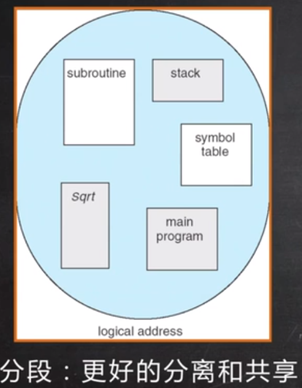
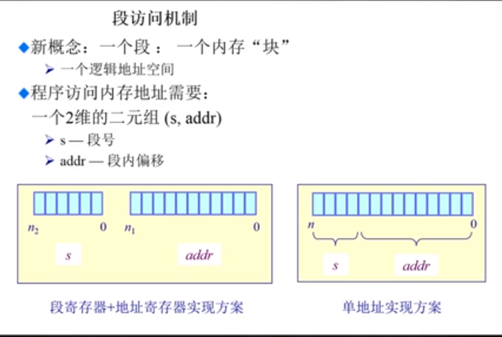
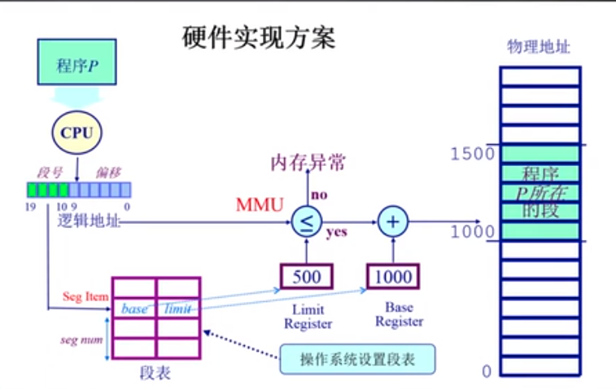

# 非连续内存分配 ： 分段

* 概述：非连续内存的分配
* 为什么需要使用非连续内存分配
  * 分段
  * 分页

* 连续分配的缺点
  * 分配给一个程序的物理内存是连续的
  * 内存的利用率较低
  * 有外碎片和内碎片的问题
* 非连续分配的优点
  * 一个程序的物理内存的地址空间是不连续的
  * 更好的内存利用和管理
  * 允许共享代码和数据（共享库等.....）
  * 支持动态加载和动态链接
* 非连续分配的缺点
  * 如何建立逻辑地址到物理地址之间的转换
    * 软件方案（开销相当的大）
    * 硬件方案
  * 两种硬件方案
    * 分段
    * 分页

## 分段

* 程序的分段地址空间
* 分段寻址方案

> 计算机程序由各个分段组合而成的（主程序，子程序，共享的库；栈段，堆段，共享数据段）。如果我们有一种方法可以把这些段有效的区别开来，隔离开来的话，我们就可以进行有效的管理我们的程序

)

* 程序的逻辑地址空间是连续的地址空间，但是通过分段之后，我们可以将它的内容隔离开来。

## 分段寻址方案

### 段访问机制

> 程序的逻辑地址是连续的地址，但是每一个段的地址不是连续的，我们可以将一个程序内的地址分为两个部分，一个是段的地址，一个是段内的偏移地址

* 新概念 ：一个段 ： 一个内存块
* 程序访问的过程需要：
  * 一个 2 维的二元组(s, addr):
    * s : 段号
    * addr : 段内的偏移地址

### 硬件实现方案

1. 一个程序需要在 CPU 中进行执行，那么 CPU 就需要到物理内存中去查找变量和函数的地址。这个逻辑地址被分为两块，第一块是段号， 剩下的部分是段内的偏移地址。
2. 我们希望可以通过段号来查找到这个段在内存中的物理地址的起始地址，这个时候我们就需要一个段表。每一个段的大小是不一样的，我们还需要知道每一个段的限制大小，所以这张表中不断存储了地址的映射的关系，还存储了段的大小限制信息
3. 段表在什么时候建立？段表是我们的操作系统在进行正式的寻址之前就应该建好

