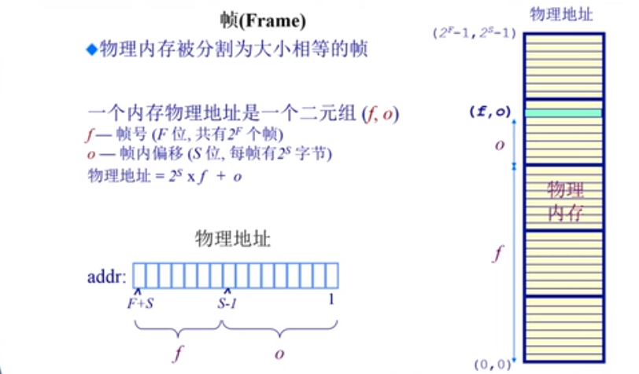
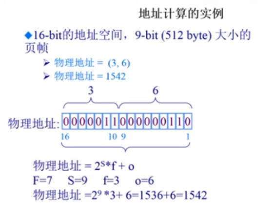
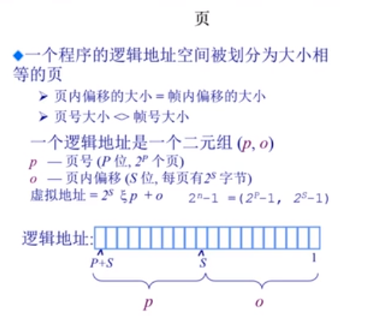
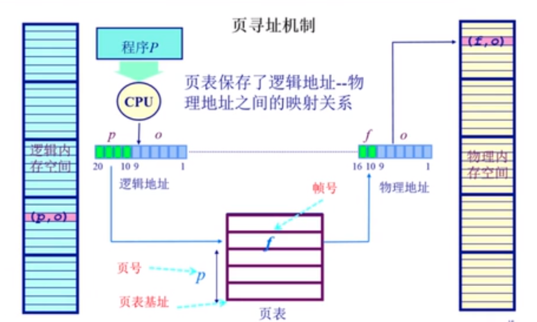
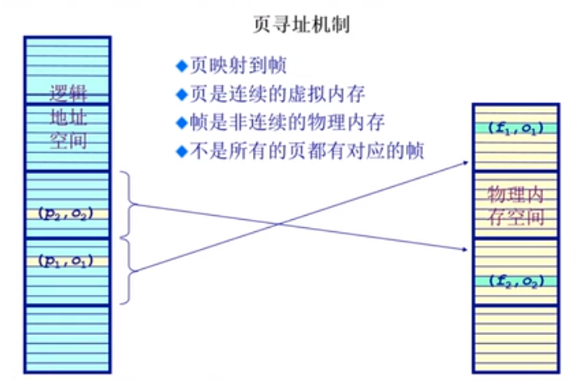

# 非连续内存分配：分页

> 现在的 CPU 使用分段的比较的少，现在的CPU 的寻址更多的采用的是分页的机制

## 分页

* 分页地址空间
* 页寻址实现方式

> 分页机制和分段机制很相似，同样的，分页也需要一个页号和一个页内的偏移。在分段的机制中，段的大小是可变的，在分页的机制中，页帧的大小是固定不变的

### 划分物理内存至固定大小的帧

* 大小是 2 的幂，比如 512, 4096, 8192（**物理地址正的页帧我们称之为 frames**）

### 划分逻辑地址空间至相同大小的页

* 大小是 2 的幂，比如 512, 4096, 8192
* 逻辑的页和物理的页大小是一样的（**逻辑地址中的页帧我们称之为 pages**）

### 建立方案 转换逻辑地址为物理地址（pages to frames）

* 页表
* MMU/TLB

## 帧 （frame）

### 一个例子

## 页 （pages)

* 一个程序的逻辑地址空间被划分为大小相同的页
  * **页内的偏移地址的大小 = 帧内的偏移地址大小相同**
  * **页号 和 帧号大小可能不一样**

## 页寻址的机制

* CPU 的寻址，这个逻辑地址分为两个部分，分别为页号p, 一个是页内的偏移地址 o
* 我们将上面的页号 p 作为索引，在一个页表中去进行查询，我们就可以得到这个页号，相对应的帧号
* 我们根据帧号和偏移地址我们就可以定位到具体的物理内存的地址

> 1. 页表是由操作系统来建立的，在操作系统初始化的时候就需要建立好，后面还会详细的讲解
>
> 2. 分页机制每一个页帧的大小是固定的
>
> 3. 我们以页组成的逻辑地址的大小和以帧组成的物理地址的大小一般情况下是不相同的(虚拟内存中详细讲解这一部分)

