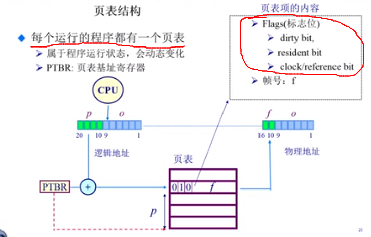
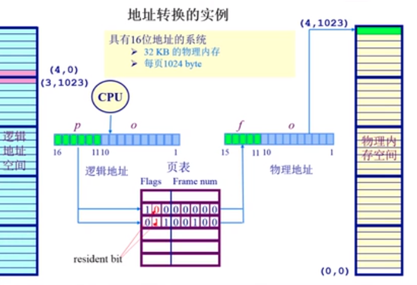
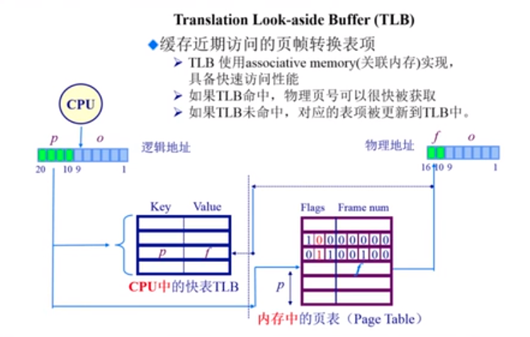

# 非连续内存分配：页表概述-TLB

## 页表

* 页表概述
* 转换后备缓冲区 (TLB)
* 二级/多级 页表
* 反向页表

## 页表的结构

* **每一个运行的程序都有一个页表**
  * 属于程序运行状态，会动态的变化
  * PTBR : 页表基地址寄存器

> 我们根据页表的基地址，开始向上数，找到页号所对应的位置。页表里面存储的数据分为两个部分，从图中看，前面的三个比特是标志位，表示这个页号的状态和页号对应的帧物理内存的状态，比方说，第二位为 1 表示这个页号对应的帧号存在，我们可以寻址到物理内存；如果这个比特为 0 表示这个页号没有对应的帧号，无法访问到对应的物理内存（CPU 抛出异常），标志位后面的部分存储的就是帧号

## 地址转换实例

## 分页机制的性能问题

* 问题：访问一个内存单元需要两次的内存的寻址过程
  * 一次是查询页表
  * 一次是访问内存数据
* 页表可能非常的大
  * 64 位的机器如果每一页 1024 个字节，那么一个页表大小是多大  ${2^{54}}$
* 如何处理
  * 缓存（将最常用的部分放在离 CPU 最近的地方）
  * 间接访问（把一个很大的空间，拆为多个小的空间，使用多级页表来进行访问）

## TLB

> 进程访问的 页表项我们存储在 TLB 当中，CPU可以进行快速的查找
>
> 如果 TLB 没有命中，那么就需要到页表中去查找，并且这个页表项会被放入到 TLB 当中
>
> 在x86 架构中，TLB miss 之后，从 页表中查询页表项完全是硬件自身就可以完成的，不需要操作系统的参与。在其他的架构当中 (MIPS) 需要操作系统的帮助完成

