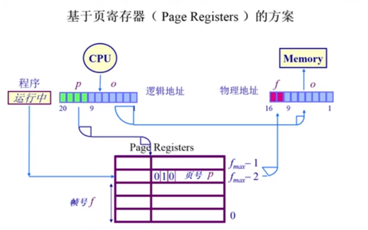
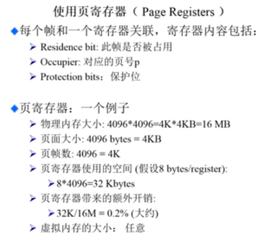
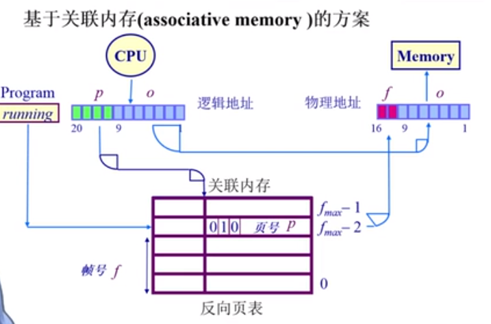

# 非连续内存分配：页表--反向页表

## 非连续内存分配

> 如果是一个 64 bits 的寻址空间的话，那么逻辑地址的总大小有 ${2^{64}}$ 大小，即是使用 5级的页表，那么页表的大小依然是非常的大

## 基于页寄存器（page registers）的方案

1. 页寄存器的索引是物理内存的帧号，而对应的内容是逻辑内存的页号，这就使得页寄存器的大小只和物理内存的大小有关
2. 使用页寄存器的问题在与，CPU 的寻址是通过页号去查询帧号，那么如何使用页寄存器来查找帧号？

## 使用页寄存器

* 物理内存的每一帧和一个寄存器相关联，寄存器的内容包括：
  * Residence bit : 次帧是否被使用
  * Occupier : 对应的页号
  * Protection bits : 保护位
* 页寄存器：一个例子
  * 物理内存的大小为 ${4096 \times 4096 = 4K \times 4KB = 16MB}$
  * 页面的大小为 ${4096 bytes = 4KB}$
  * 页帧的数量就是 ${4096 = 4K}$
  * 页寄存器使用的空间大小为 (假设是 8 bytes/register)
    * ${8 \times 4096 = 32Kbytes}$
  * 页寄存器带来的额外的开销为 
    * ${32K / 16M = 0.12 \%}$
  * 虚拟内存的大小 : 任意

## 页寄存器的方案的权衡

* 利：
  * 转换表的大小相对于物理内存来说很小
  * 转换表的大小和逻辑地址空间的大小没有任何的关系
* 弊：
  * CPU 需要的信息对调了，根据帧号可以找到页号(?)
  * 如何转换回来？即根据页号寻找帧号
  * 需要在反向表中搜索想要的页号（全部遍历？）

## 基于关联内存的设计

> 关联存储器是一种非常特殊的存储器，这种存储器可以并行进行查找。在上面的图中，我们以页号进行搜索，查证其对应的帧号。
>
> 关联存储器的硬件逻辑十分的复杂，所以关联存储器不可能太大。

## 在反向页表中搜索一个页对应的帧号

* 如果物理内存的帧数量比较的少的话，那么我们可以将整个页寄存器可以放到关联存储器当中，
* 在关联内存中查找逻辑页号
  * 成功：帧号被提取出来
  * 失败：页错误异常
* 限制因素：
  * 大量的关联内存非常的昂贵
    * 难以在单个时钟周期内完成
    * 耗电

> 反向页表只在一些很高级的 CPU 里面采参用了这种方案

## 基于Hash 查找的方案

我们需要设计一个非常高效的 hash 函数，让我们可以根据逻辑页号，快速的查找到相对应的物理帧号。如何设计一个好的 hash 函数，如何解决 hash 冲突是一个问题