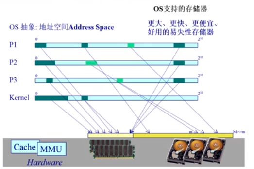
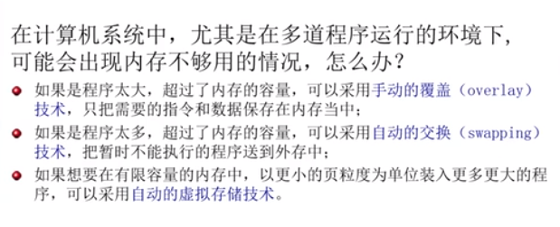

# 虚拟内存的起因

* 起因
* 覆盖技术
* 交换技术
* 虚拟内存技术
  * 目标
  * 程序局部性实现
  * 基本概念
  * 基本特征
  * 虚拟页式内存管理

## 操作系统支持的存储器

* register : 处理器的寄存器是访问最快的存储器，但是成本非常的高，所以一般情况下非常的小
* cache : 处理器的缓存也是一种访问速度非常快的存储器，但是成本也比较的高，大小一般也不是很大
* 主存：现在可以做的比较的大，成本不是很高
* 硬盘：硬盘的成本很低，而且容量非常的大

* 在计算机系统中,尤其是在多道程序运行的环境下,可能会出现内存不够用的情况,怎么办?
  * 如果是程序太大,超过了内存的容量,可以采用**手动的覆盖( overlay)技术**,只把需要的指令和数据保存在内存当中
  * 如果是程序太多,超过了内存的容量,可以采用**自动的交换( swapping)技术**,把暂时不能执行的程序送到外存中
    * 交换的代价是非常大的，因为需要将整个程序进行导入和导出
  * 如果想要在有限容量的内存中,以更小的页粒度为单位装入更多更大的程序,可以采用**自动的虚拟存储技术**