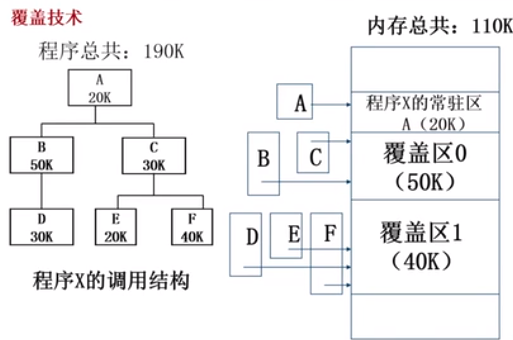

# 覆盖技术

目标：

* 在比较小的可用内存中运行比较大的程序，常常用于**多道程序系统**，与分区存储管理配合使用

## 覆盖技术

1. 目标:
   * 是在较小的可用内存中运行较大的程序。常用于**多道程序系统,**与分区
     存储管理配合使用。
2. 原理:
	* 把程序按照其自身逻辑结构,划分为若干个功能上相对独立的程序模块,**那些不会同时执行的模块共享同一块内存区域**,按时间先后来运行。
* 必要部分(常用功能)的代码和数据常驻内存
* 可选部分(不常用功能)在其他程序模块中实现,平时存放在外存中,在需要用到时才装入内存
* 不存在调用关系的模块不必同时装入到内存,从而可以相互覆盖,即这些模块共用一个分区

## 例子

> 粒度是以程序的逻辑调用关系来进行分区的，所以有不同的分区的方案
>
> 例如我们可以采用 B,E,F 共享一个覆盖区

### 缺点

* 由于程序员要把一个大的程序划分为若干个小的功能模块，并确定每一个模块之间的覆盖的关系，费时费力，增加了编程的复杂度
* 覆盖模块从外存装入内存，实际上是以时间的延时换取空间