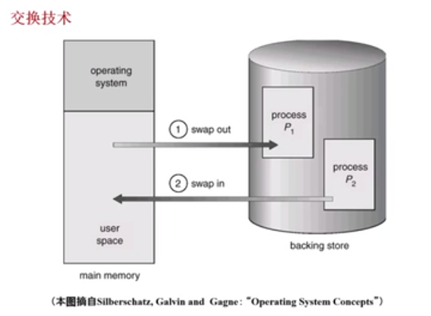

# 交换技术

* 目标
  * 多道程序在主存中时， 让正在运行的程序或需要运行的程序获得更多的内存资源
* 方法：
* 可将暂时不运行的程序送到外存当中，从而获得空闲内存的空间
* **操作系统**把一个进程的整个地址空间的内容保存到外存（换出 swap out） ，而将外存中的某个进程的地址空间读入到内存中(换入 swap in) 。换入换出内容的大小为整个程序的地址空间

## 交换技术

### 交换技术中的几个问题

* 交换时间的确定：何时进行交换？只有当内存空间不够或者有不够的危险的时候进行交换
* 交换区的大小：必须足够的以存放所有用户进程的所有的内存映像的拷贝；必须能对这些内存映像进行直接存取
* 程序换入时的重定向：换出后再换入的内存的位置一定会在原来的位置上吗？如果两次内存的位置不一样的时候，如何确定新的逻辑地址和物理地址的映射关系？最好采用**动态的地址映射**的方法

> 交换的技术时操作系统自动完成，对于我们的用户来说时透明的

### 覆盖和交换的区别

* 覆盖只会发生在那些相互之间没有调用关系的程序的模块之间，因此程序员必须给出程序内的各个模块之间的逻辑覆盖的关系
* 交换技术是以内存当中的程序大小为单位进行的，它不需要程序员给出各个模块之间的逻辑覆盖的关系。换言之，交换发生在内存中的程序与管理程序或者操作系统之间，而覆盖发生在运行程序的内部

* 粒度上的区别 ： 覆盖的粒度是程序内的模块 / 交换是整个程序

