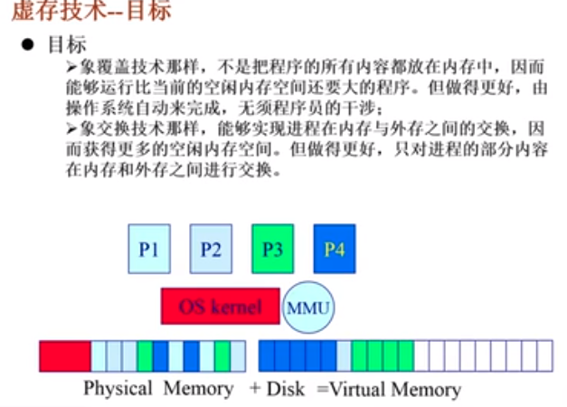
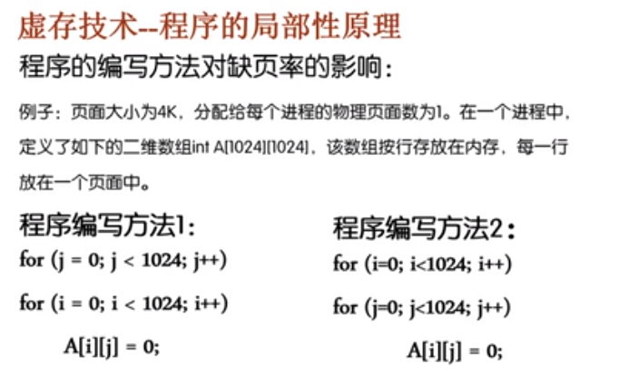
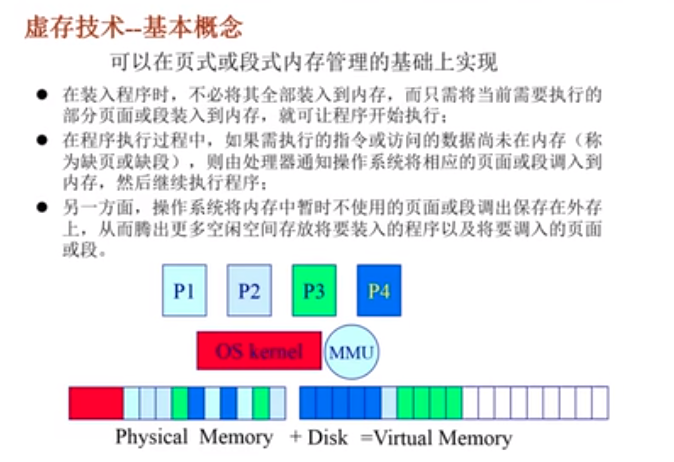
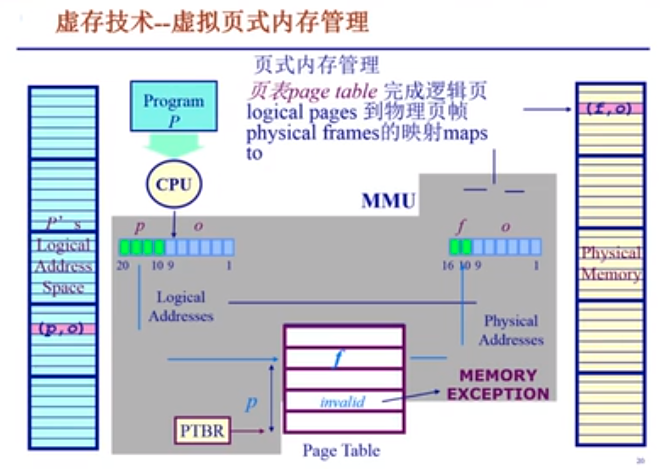
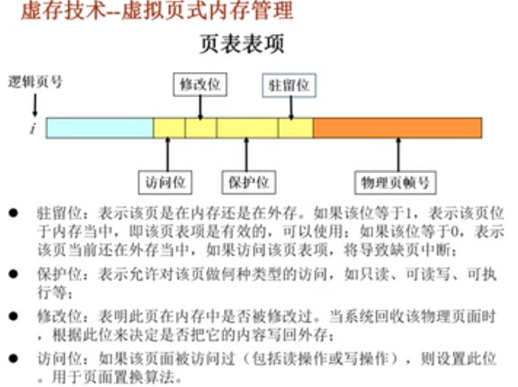
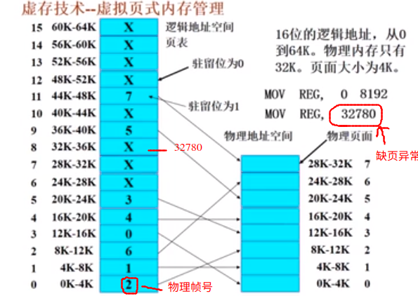
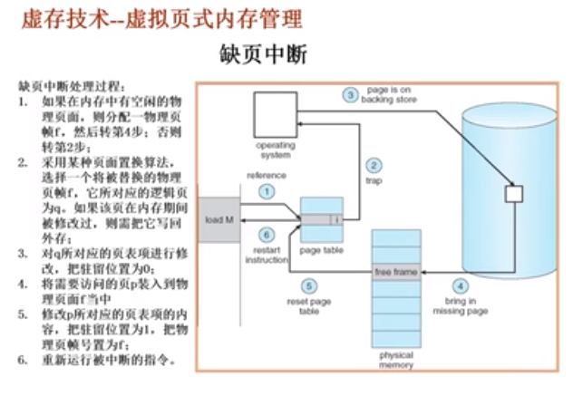
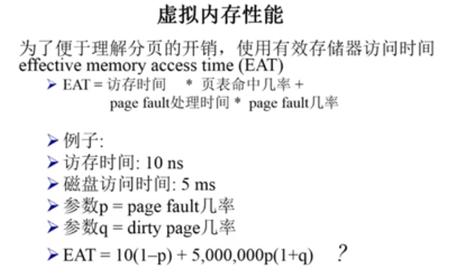

# 虚拟内存管理技术

* 在内存不够的情况下，我们可以采用覆盖技术或者采用交换技术
  * 覆盖技术：需要程序员自己把程序划分为若干个小的功能模块，并确定模块之间的覆盖的关系
  * 交换技术：以进程作为单位，需要把整个进程的地址空间全部进行换入和换出的操作，增加了处理器的开销
* “四海之内的”解决之道：虚拟内存管理技术

## 目标

* 不是把程序的所有的内容放在内存当中，因而能够运行比当前的空闲内存空间还要大的程序，但是做的更好，由操作系统自动完成，无需程序员的干预
* 能够实现进程的内存与外存之间的交换，因而获得更多的空闲内存空间，但是做的更好，只对进程的部分内容在内存和外存之间进行交换

## 虚存技术---程序的局部性原理

虚存技术程序的局部性原理 程序的局部性原理( principle of locality): 指程序在执 行过程中的一个较短时期,**所执行的指令地址和指令的操作数地址,分别局限于一定区域**。这可以表现为:

*  时间局部性:一条指令的一次执行和下次执行,一个数 据的一次访问和下次访问都集中在一个较短时期内; 

* 空间局部性:当前指令和邻近的几条指令,当前访问的 数据和邻近的几个数据都集中在一个较小区域内。 

程序的局部性原理表明,从理论上来说,虚拟存储技术是能够实现的,而且在实现了以后应该是能够取得一个满意的效果的。 

### 例子

第一个程序是按照列遍历的方式进行处理，第二个程序是按照行遍历的方式进行处理。内存中的数组的存放是以行进行存储的。

一个页面只能存储数组中的一行。方法一在遍历的过程中，将会发生 ${1024 \times 1024}$ 的缺页异常。第二种遍历的方法只会发生 ${1024}$ 次缺页异常

## 虚存技术---基本概念

* 可以在页式或段式内存管理的基础上实现
* 在装入程序时,不必将其全部装入到内存,而只需将当前需要执行的**部分页面或段装入到内存**,就可让程序开始执行 
* 在程序执行过程中,如果需执行的指令或访问的数据尚未在内存(**称为缺页或缺段**),则由处理器通知操作系统**将相应的页面或段调入到 内存,然后继续执行程序** ·
* 另一方面,操作系统将内存中暂时不使用的页面或段调出保存在外存 上,从而腾出更多空闲空间存放将要装入的程序以及将要调入的页面或段。 

## 虚存技术---基本特征

* 大的用户空间:通过把物理内存与外存相结合,提供给用 户的虚拟内存空间通常大于实际的物理内存,即实现了这两者的分离。如32位的虚拟地址理论上可以访问4GB,而可能计算机上仅有256M的物理内存,但硬盘容量大于4GB 
* 部分交换:与交换技术相比较,**虚拟存储的调入和调出是对部分虚拟地址空间进行的**;
*  不连续性:物理内存分配的不连续,虚拟地址空间使用的不连续。

## 虚存技术--- 虚拟页式内存管理

* 大部分虚拟存储系统都采用虚拟页式存储管理技术，即在页式存储管理的基础上，**增加请求调页和页面置换功能**
* 基本思路：
  * 当一个用户程序要调入内存运行的时候，不是将该程序的所有的页面都装入到内存当中，而是只装入部分的页面，就可以启动程序
  * 在运行程序的过程中，如果发现要运行的程序或者要访问的数据不再内存中（在页表中，逻辑地址没有对应的物理地址），则向系统发出缺页中断请求，系统在处理这个中断时，将外存中的相应的页面调入到内存，使得该程序可以继续运行

### 页表表项

1. 驻留位：表示该页是在内存中还是在外存中。如果该位为 1，表示该页位于内存当中，即表示该页表项是有效的，可以使用；如果该位为0，表示该页当前在外存当中，如果要访问该页的内容，将导致缺页中断
2. 保护位：表示允许对该页做何种类型的访问，如只读，可读写，可执行等
3. 修改位：表明此页在内存中是否被修改过，当系统回收该物理页时，根据此位来决定是否把它的内容写入到外存中
4. 访问位：如果该页面被访问过（包括读操作和写操作），则设置此位，用于页面置换算法

### 例子

### 缺页中断

1. 如果在内存中有空闲的物理页面，则分配一个物理页帧 f ，然后转到第四步，否则转到第二步
2. 如果内存中没有空闲的物理页面，那么我们采用一种页面置换的算法，选择一个将被替换的物理页帧 f, 它所对应的逻辑页位 q。 如果该页在内存期间发生了改变，那么我们需要把他重新写入外存
3. 对 q 所对应的页表项进行修改，把驻留位设置为 0
4. 将需要访问的页面p 装入到物理页面 f 当中
5. 修改 p 所对应的页表项的内容，把驻留位设置为 1，把物理页帧的数据设置为 f
6. 重新运行被中断的指令

## 后备存储 (backing store)

### 在什么地方保存未被映射的页？

* 能够简单地识别在二级存储器中的页
* 交换空间（磁盘或者文件）：特殊格式，用于存储未被映射的页面

### 概念：后备存储

* 一个虚拟地址空间的页面可以被映射到一个文件（在二级存储中）中的某一个位置
* 代码段：映射到可执行二进制文件
* 动态加载的共享库程序段：映射到动态调用的库文件
* 其他段：可能被映射到交换文件(swap file)

## 虚拟内存的性能

