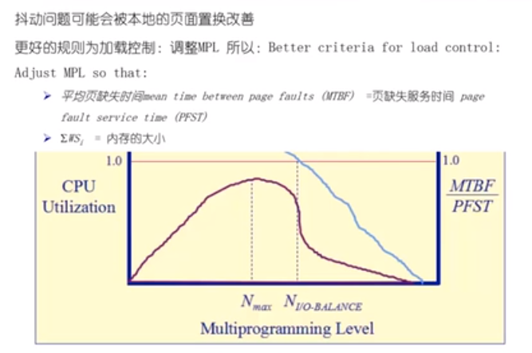

# 抖动问题

* 如果分配给一个进程的物理页面太小，不能包含整个工作集，那么进程将会发生很多的缺页中断，操作系统需要频繁在外存和内存之间进行页面的替换，从而使得进程运行的速度变得非常的慢，这个状态被称之为抖动
* 产生抖动的原因：随着驻留内存的进程的数目的增加，分配给每一个进程的物理页面的大小不断的减少，缺页率也就上升。操作系统需要选择一个适当的进程的数目和进程需要的帧数，以便在并发和缺页之间选择一个折中

* 红色的线 ----- CPU 的利用率
* 蓝色的线 ----- $\frac{MTBF}{PFST}$

> $N_{max}$ 个进程在操作系统中运行， CPU 的使用效率可以达到最高，但是如果我们希望还可以运行更多的进程，又有比较高的 CPU 的利用率的话，我们希望找到 $\frac{MTBF}{PFST}$ 的比值接近 1 的地方（**IO 达到最佳的效率**），这个地方的 CPU 的效率依然比较的高

> 上面的图只是一个大致的表示