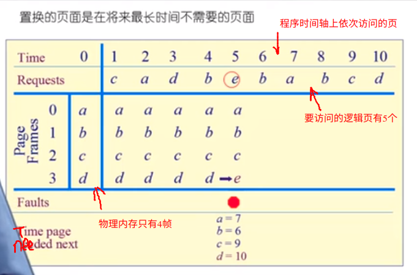
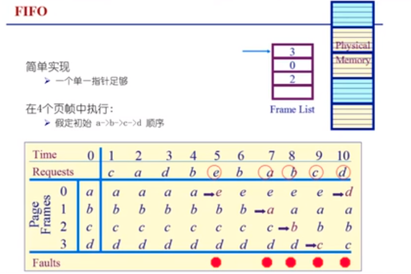
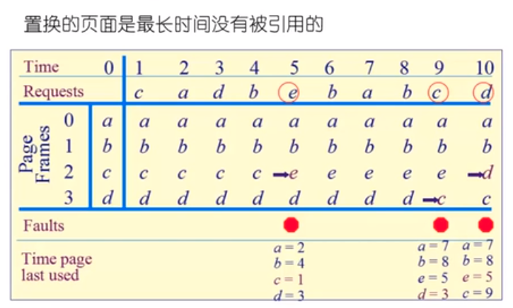
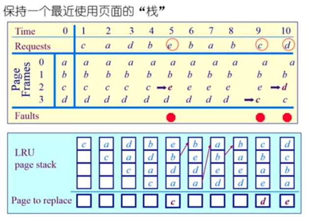
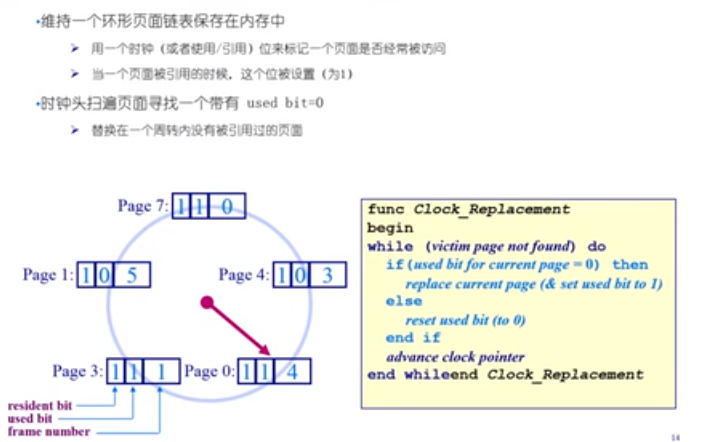
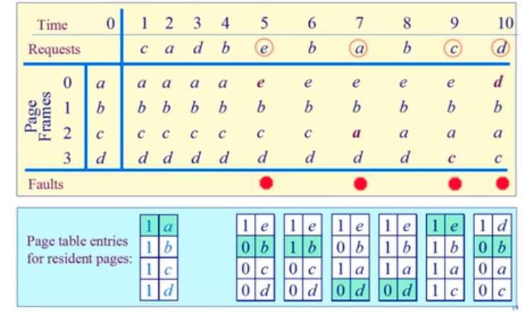
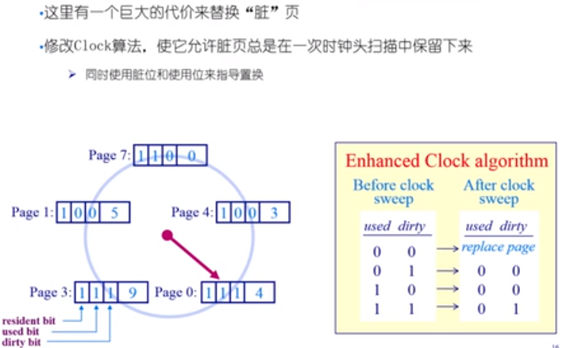
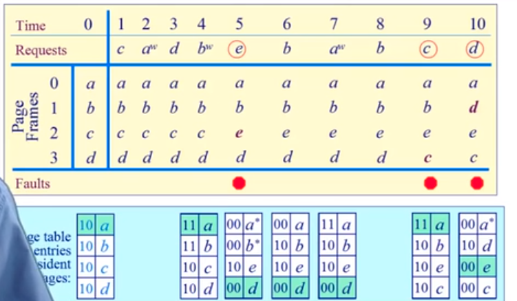
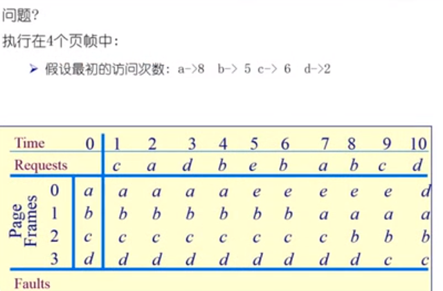

# 最优页面置换算法

* 局部页面置换算法
  * 最优页面置换算法(OPT, optimal)
  * 先进先出算法(FIFO)
  * 最近最久未使用算法(LRU,Least Recently Used)
  * 时钟页面置换算法（Clock)
  * 最不常用算法（LFU,Least Frequently Used）
  * Belady 现象
  * LRU, FIFO和 Clock 的比较
* 全局页面置换算法
  * 工作集模式
  * 工作集页置换算法
  * 缺页率置换算法

## 功能目标

* 功能：当缺页中断发生的时候，需要调入新的页面而内存已经满了，选择内存当中哪个物理页面被置换
* 目标：**尽可能父的减少页面的换入和换出的次数**（即缺页中断的次数）。具体来说，把未来不再使用的或者短期内较少使用的页面换出，通常只能在局部性原理指导下依据过去的统计数据来进行预测
* **页面锁定**（frame locking）: 用于描述必须常驻内存的操作系统的关键部分或者时间关键(time-critical) 的应用进程。实现的方法是：在页面中添加锁定标志位(lock bit)

## 1. 最优页面置换算法

### 基本思路

当一个缺页中断发生的时候，对于保存在内存中的每一个逻辑页面，计算在它的下一次访问之前，还需要等待多长的时间，从中选择等待时间最长的那个，作为置换的页面。

这只是一种理想的情况，在实际系统中时无法实现的，因为操作系统无从知道每一个页面要等待多长的时间之后才会再次被访问

可用作其他算法的性能评价的依据（在一个模拟器上运行某个程序，并记录每一次的页面访问的情况，在第二次运行时即可使用最优算法）

### 例子

* 最优页面置换算法置换的页面时将来最长时间不需要的页面

## 2. 先进先出算法

基本思路：选择在内存中驻留的时间最长的页面并淘汰。具体来说，系统维护一个链表，记录了所有位于内存当中的逻辑页面。从链表的排列顺序来看，链表首页面的驻留时间最长，链表尾页面的驻留时间最短。当发生一个缺页中断的时候，把链表首的页面淘汰出局，并把新的页面添加到链表的末尾

性能较差，调出的页面有**可能是经常要访问的页面**，并且有 **Belady 现象**. FIFO 算法很少单独使用

### 例子

## 3. 最近最久未被使用算法（LRU）

基本思路：当一个缺页中断发生的时候，选择最久未使用的那个页面，并淘汰这个页面

它是对最优页面置换算法的一个近似，其依据是程序的局部性原理，即在最近一小段时间（最近几条指令）内，如果某些页面被频繁的访问，那么在将来的一小段时间内，它们可能还会再一次的被访问。反过来，如果过去某些页面长时间没有被访问，那么在将来它们还可能长时间得不到访问

### 例子

LRU 算法需要记录各个页面使用时间的先后顺序

开销比较的大。有两种可能的实现方法：

* 系统维护一个页面链表，最近刚刚使用过的页面作为首节点，最近未使用的页面作为尾节点。每一次访问内存时，找到相应的页面，把它从链表中拿出来，移动到链表的首部。每一次发生缺页中断的时候，淘汰链表尾部的页面
* 设置一个活动页面栈，当访问某个页时，将这个页号压入到栈的顶部。然后，考察栈中是否有与此页面相同的页号，若有的话，则抽出。到需要淘汰一个页面的时候，总是选择栈底的元素，它就是最久没有使用的

## 4. 时钟页面置换算法

Clock 页面置换算法，LRU 的近似，对 FIFO 的一种改进

 基本思路：

* 需要用到页表项当中的访问位，当一个页面被装入内存的时候，把该位初始化为 0 。然会如果这个页面被访问（读/写），则把这个位置设置为 1
* 把各个页面组织成环形链表（类似钟的表面），把指针指向最老的页面（最先近来）；
* 当发生一个缺页中断的时候，考察指针所指向的最老页面，若它的访问位为 0，立即淘汰；若访问位为1，则把该位设置为 0，然后把指针往下移动一格。如此下去，知道找到被淘汰的页面，然后把指针移动到它的下一格

* dirty bit 
  * 在内存的页表项中，还有一个关键的标志位，dirty bit。如果某个页做了一次写操作，那么该位就会设置为 1，如果时一个读操作的话，改位不会发生变化
  * 如果内存中的某一页的脏位一直是 0 的话，那么说明这个页在内存中没有被修改过，所以当这个页换出的过程中，那么我们没有必要将其写入到硬盘当中，因为内存中的内容和硬盘中的内容是一致的，直接中内存中释放就可以了

### 二次机会法

修改了 Clock 算法，不再只依赖于 access bit 来进行判断，还利用了 dirty bit 的信息

### 5. 最不常用算法（LFU）

基本思路：当一个缺页中断发生的时候，选择访问次数最少的那个页面，并淘汰

实现方法：对每一个页面设置一个访问计数器，每当一个页面被访问的时候，该页面的访问计数器的值就 + 1。在发生缺页中断的时候，淘汰计数值最小的那个页面

LRU 和 LFU 的区别：LRU 考察的是多久没有访问，时间越短越好；而 LFU 考察的是访问的次数或者频度，访问次数越多越好

* 一个页面可能在**程序初始化的时候，经过了多次的访问的过程，计数值比较的大，但是经过了初始化之后，这些页面几乎不再使用**了，但是由于它们的计数值依然比较的大，所以这些已经不使用的页面也不会被换出（解决的方法：定期的把次数寄存器右移一位）

