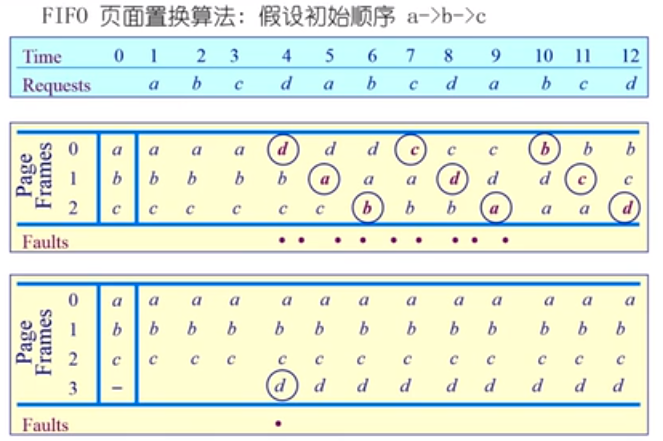
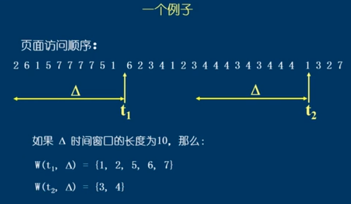

# 局部页面替换算法的问题_工作集模式

全局页面替换算法

* 局部页面替换算法的问题
* 工作集模式
* 工作集页置换算法
* 缺页率置换算法
* 抖动问题

> 上面所讲的局部页面置换算法（LRU，FIFO，Clock） 都是针对一个进程（一个运行的程序）来说的，但是我们的操作系统可以运行多个程序，那么如果每一个进程都采用一个自身的页面置换算法会出现一些问题，我们希望可以提供一个全局的页面替换算法

## 例子

> 物理页帧的大小对一个页面置换算法的影响非常的大，缺页的情况会随着物理页帧的大小发生剧烈的变化。前面考虑的情况都是固定物理页帧的大小来考虑换页算法的性能。但是操作系统中的程序在不同的运行阶段，需要的内存大小时不同的(**程序的不同的运行阶段对物理页帧的需求时不同的**)，我们是否可以根据程序运行的阶段来动态的为程序分配物理页帧的大小

## 工作集模式

> 前面的各种页面置换算法，都是基于一个前提，那就是程序的局部性原理。
>
> 如果局部性原理不成立，那么各种页面置换算法就没有什么区别
>
> 如果局部性原理时成立的，那么如何证明它的存在，如何对它进行定量的分析？**这就是工作集模式**

### 工作集

一个进程当前正在使用的逻辑页面集合，可以使用一个二元函数进行表示 ${W(t, \Delta)}$

* t 时当前的执行时刻
* $\Delta$ 成为工作集窗口，即一个定长的页面访问的时间窗口
* ${W(t, \Delta)}$ 表示当前时刻 t 之前的 $\Delta$ 时间窗口当中的所有的页面组成的集合
* ${|W(t, \Delta)|}$  指工作集的大小，即页面数目

> 工作集大小的变化：进程开始执行后，随着访问新页面逐步建立较稳定的工作集。当内存访问的局部性区域的位置大致稳定时，工作集大小也大致的稳定。

## 常驻集

常驻集是指当前时刻，进程实际驻留在内存中的页面集合

* 工作集是进程在运行过程中故性质，而常驻集取决于系统分配给进程的物理页面数目，以及所采用的页面置换算法
* 如果一个进程的整个工作集都在内存当中，那么进程将会顺利的运行，而不会造成太多的缺页中断
* 当进程常驻集的大小达到某个数目之后，再给它分配更多的物理页面，缺页率也不会明显的下降

> 常驻集是由操作系统分配给进程的物理页帧的大小，和相应的页面置换算法所共同决定的