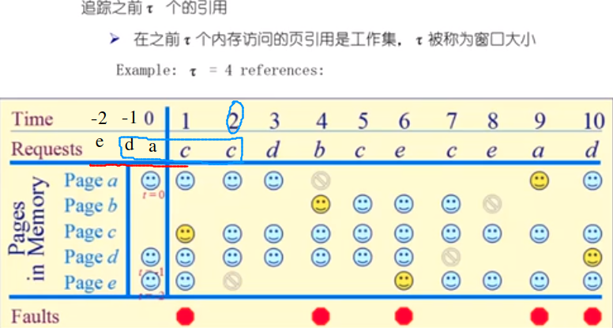
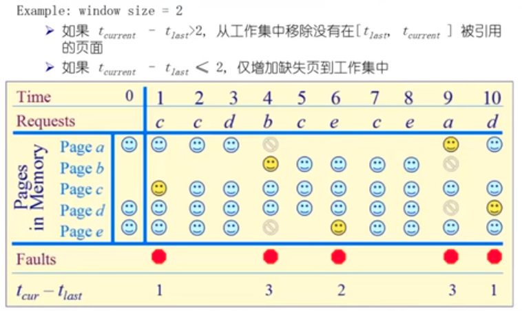

# 两个全局的页面置换算法

## 工作集页置换算法

基本思想: 我们维护一个工作集的窗口 ${W(t, \Delta)}$ 表示在执行到 $t$ 时刻的时候，前面 $\Delta$ 时间 窗口大小中，程序使用的页面。在程序运行的过程中，超出了 $\Delta$ 窗口大小的页将会被换出

### 例子

## 缺页率页面置换算法

* 可变分配策略：常驻集大小可变。例如，每一个进程刚刚运行的时候，先根据程序的大小给它分配一定数目的物理页面，然后在进程运行的过程当中，再动态的调整常驻集的大小
  * 可采用全局页面替换的方式，当发生一个缺页中断时，被置换的页面可以是在其它进程当中，各个并发进程竞争地使用物理页面
  * 优缺点：性能较好，但是增加了系统的开销
  * 具体实现：可以使用缺页率算法（PFF） 来动态的调整常驻集的大小

### 缺页率

缺页次数 / 内存访问次数 或者 缺页的平均时间间隔的倒数

影响缺页率的因素：

* 页面置换算法
* 分配给进程的物理页的大小
* 页面本身的大小
* 程序的编写方式（局部性好，缺页少，局部性差，缺页多）

> 如果运行的程序的缺页率过高，通过增加常驻集的大小来分配更多的物理页面；如果运行的程序的缺页率过低， 则通过减小常驻集的大小来减少它的物理页面的数量。使得每一个进程的缺页率保持在一个合理的范围内

### 算法

保持追踪缺失发生的概念

记录上一次发生缺页中断的时刻 ${t_{last}}$ ,当前发生缺页中断的时刻是  ${t_{current}}$ .

如果 ${t_{current} - t_{last}} > T$，那么我们从物理内存中移除所有在 ${[t_{last}, t_{current}]}$ 时间内没有被引用的页

如果 ${t_{current} - t_{last}} \leq T$，那么将缺失的页放入到当前的工作集当中

