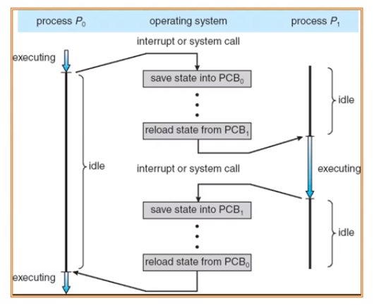

# 上下文切换

> 停止当前运行的进程并调度其他进程

1. 必须在切换之前存储许多部分的进程上下文
2. 必须能够在之后恢复它们，所以进程不能显示它曾经被暂停过
3. 必须快速

需要存储什么上下文？

* 寄存器 (PC, SP, ...) 程序计数器，栈指针，CPU 状态，。。。
* 可能会费时

* 操作系统为活跃进程准备了进程控制块
* 操作系统将进程控制块放置在一个合适的队列里

> 就绪队列
>
> 等待队列
>
> 僵尸队列

