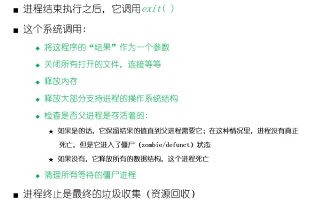
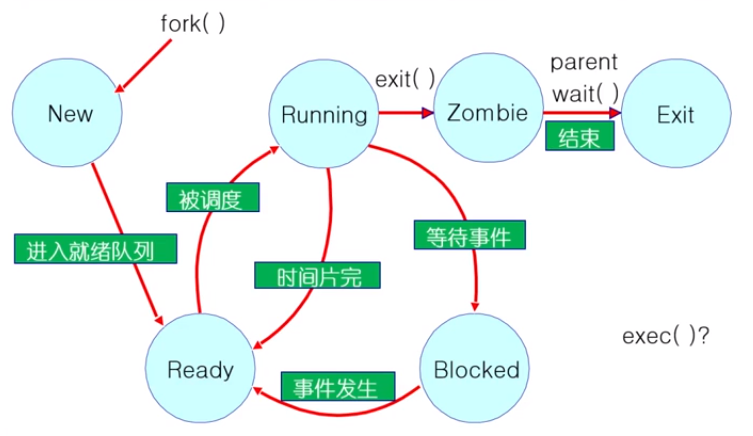

# 进程控制----等待和终止进程

> ```wait()``` 系统调用是被父进程用来等待子进程的结束
>
> 一个子进程向父进程返回一个值，所以父进程必须接受这个值并处理
>
> wait() 系统调用担任这个要求
>
> * 它使得父进程去睡眠来等待子进程的结束
> * 当一个子进程调用 exit() 的时候，操作系统解锁父进程，并且将通过 exit() 传递得到的返回值作为 wait() 调用的一个结果，如果没有子进程的话，那么 wait() 立刻返回
> * 如果这里有子进程处在僵尸等待，那么 wait() 立刻返回一个值，并解除子进程的僵尸状态



