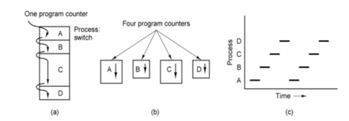
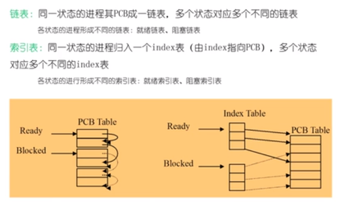
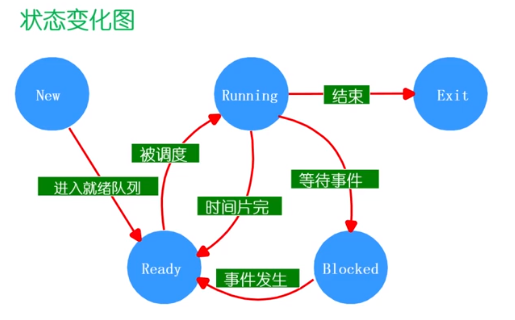
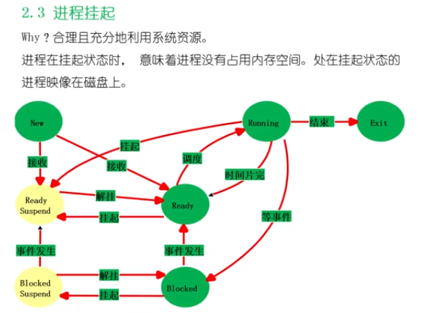
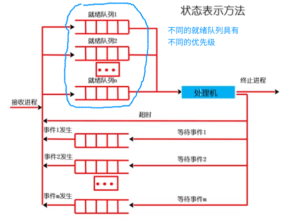

# 进程的定义

1. 进程的描述
2. 进程的状态
3. 线程
4. 进程间的通信
5. 进程互斥和同步
6. 死锁

## 进程的描述

### 定义

一个具有一定独立功能的程序在一个数据集合上的一次动态执行过程

## 进程的组成

* 程序的代码
* 程序处理的数据
* 程序计数器中的值，指示下一条将要执行的指令
* 一组通用的寄存器的当前值，堆，栈
* 一组系统资源(如，打开的文件)

> 总之，进程包含了正在运行的一个程序的所有的状态信息

### 进程和程序之间的联系

* 程序是产生进程的基础
* 程序的每一次执行构成不同的进程
* 进程是程序功能的体现
* 通过多次执行，一个程序可以对应多个进程；通过调用关系，一个进程可以包含多个程序

### 进程和程序之间的区别

* 进程是动态的，程序是静态的：程序是有序代码的集合；进程是程序的执行，进程有核心态和用户态

* 进程是暂时的，程序是永久的：进程是一个状态的变化过程，程序可以长久的保存
* 进程与程序的组成不同：进程的组成包括程序，数据和进程控制块（即进程的状态信息）

### 进程的特点

* 动态性：可动态的创建，结束进程
* 并发性：进程可以被独立调度并占用处理机运行；并发并行
  * 并行：对于多核心处理器，可以实现多个进程在同一个时刻同时进行运行
  * 并发：CPU 的上下文切换，让我们看起来多个进程同时在运行（实际上多个进程是在不同的时间片运行的）
* 独立性：不同进程的工作不相互影响
* 制约性：因访问共享数据，资源或者进程间同步而产生制约

### 程序 = 算法 + 数据结构

描述进程的数据结构：进程控制块(Process Control Block, PCB)

操作系统为每一个进程维护一个 PCB ,用来保存与该进程有关的各种状态信息

## 进程控制结构

进程控制块：操作系统管理控制进程运行所用的信息集合。操作系统使用 PCB 来描述进程的基本情况已经运行状态的变化过程，PCB 是进程的唯一标识

### 使用进程控制块

* 进程的创建：为该进程生成一个 PCB
* 进程的终止：回收它的 PCB
* 进程的组织管理：通过对 PCB 的组织管理来实现

### PCB 包含的三大类信息

1. 进程标识 : 本进程的标识，本进程的产生者标识；用户标识

2. 处理机 状态信息保存区。

   * 用户可见寄存器。用户程序可以使用的数据，地址等寄存器
   * 控制和状态寄存器。如程序计数器（PC），程序状态字（PSW）
   * 栈指针，过程调用/系统调用/中断处理和返回时需要用到它

3. 进程控制信息

   * 调度和状态信息，用于操作系统调度进程并占用CPU使用
   * 进程间通信信息
   * 存储管理信息，包含有指向本进程映像存储空间的数据结构
   * 进程所用的资源，说明由进程打开，使用的系统资源，如打开的文件
   * 有关数据结构连接信息，进程可以连接到一个进程队列中，或者连接到相关的其他进程的 PCB

   

   ### PCB 的组织方式

   链表：同一状态的进程其PCB连接成一个链表，多个状态对应多个不同的链表

   * 各状态的进程形成不同的链表：就绪链表，阻塞链表

   索引表：同一状态的进程归入一个 index 表（由 index 指向 PCB），多个状态对应多个不同的 index 表

   * 各状态的进程形成不同的索引表：就绪索引表，阻塞索引表

   

   

## 进程的生命期原理

### 进程的状态

   * 进程的生命期的管理
   * 进程状态变化的模型
   * 进程挂起模型

### 进程的生命期的管理

   * 进程创建
   * 进程运行
   * 进程等待
   * 进程唤醒
   * 进程结束

### 进程创建

   引起创建进程的三个主要事件：

   * 系统初始化的时候 （init 进程）
   * 用户请求创建一个新的进程
   * 正在运行的进程调用了创建进程的系统调用

### 进程运行

   内核选择一个就绪进程，让他占用处理器并执行

   * 如何选择？
   * 为何选择？

### 进程等待

   在以下的情况下，进程需要进行等待：

   1. 请求并等待系统服务，无法马上完成（比如进程使用系统调用读取文件，这个读取的过程很慢，如果这个时候我们让进程在这里循环等待读取文件，那么会浪费 CPU 的性能）
   2. 启动某种操作，无法马上完成（比如一个进程依赖于另一个进程的运行结果，在另一个进程执行完毕之前，当前的进程需要进行等待）
   3. 需要的数据没有到达

   > 进程只能自己阻塞自己，因为只有进程自身才能知道何时需要等待某种事件的发生。
   >
   > 比如说，读 IO 进程可以选择阻塞式的读取，也可以选择非阻塞式的读取。读 Tcp socket，可以选择阻塞读，也可以选择非阻塞方式，选择权在进程自己的手上

### 进程的唤醒

   唤醒进程的原因：

   1. 被阻塞进程需要的资源被满足了
   2. 被阻塞的进程等待的事件到达了
   3. 将该进程的 PCB 插入到就绪状态

   > 进程只能被其他的进程或者操作系统进行唤醒

### 进程结束

   以下的四种情况，进程结束

   * 正常退出（自愿的）
   * 错误退出（自愿的）
   * 致命错误（强制性的）
   * 被其他进程所杀

   

## 进程状态变化模型

* 进程的三个基本状态：

运行状态：当一个进程正在CPU 上进行处理

就绪状态：一个进程获取到了除了 CPU 以外的所有的一切需要的资源，一旦得到了 CPU 就可以执行

等待状态（又称之为阻塞状态 Blocked） : 一个进程正在等待某一个事件的发生而暂停了运行。如等待某种资源，等待输入/输出完毕等。

* 进程的其他基本状态

创建状态：一个进程正在被创建，还没有转到就绪状态之前的一种状态

结束状态：一个进程正在从系统中消失的状态，这是因为进程结束或者其他的原因导致的

### 可能的变化

NULL -> new : 一个新进程被产生出来执行一个程序(产生了 PCB)

New -> Ready :  当一个进程被创建完成并初始化后，一切就绪准备运行，变为就绪状态。

Ready -> Running : 处于就绪状态的进程被进程调度程序选中后，就分配到处理机上来运行

Running -> Exit : 当进程表示它已经完成或者因出错，当前运行的进程会由操作系统作结束处理

Running -> Ready : 处于运行状态的进程在其运行的过程中，由于分配给它的处理机的时间片用完了，而让出了处理机

Running -> Blocked : 当进程请求某样东西且必须等待

Blocked -> Ready : 当进程要等待的事件到来时，它从阻塞态变到就绪态

## 进程挂起

> 进程在挂起状态的时候，意味着进程没有占用内存空间。处在挂起状态的进程映像在磁盘上

### 挂起状态

* 阻塞挂起状态 ： 进程在外存并等待某些事件的出现
* 就绪挂起状态：进程在外存当中，但是只要进入内存，就马上到就绪态

### 与挂起相关的状态转化

* 阻塞到阻塞挂起：当就绪的状态发现自己运行的内存不够用了，那么操作系统会把一些阻塞状态的进程写入到外存当中，从阻塞态转换到阻塞挂起状态
* 就绪到就绪挂起状态：当有高优先级阻塞进程（系统认为它会很快的就绪）和低优先级就绪进程时，系统会选择挂起低优先级就绪进程
* 运行到就绪挂起

* 从阻塞挂起到就绪挂起

#### 解挂/激活：把一个进程从外存转换到内存

* 就绪挂起到就绪
* 阻塞挂起到阻塞

## 状态队列

> 操作系统维护一组队列，用来表示系统当中所有进程的当前状态
>
> 不同的状态奉表用不同的队列来表示（就绪队列，各种类型的阻塞队列）
>
> 每个进程的 PCB 都根据它的状态加入到相应的队列当中，当一个进程的状态发生变化时，它的 PCB 从一个状态队列中脱离出来，加入到另一个队列

 

