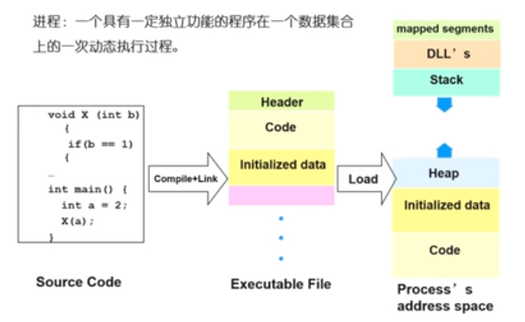

# 进程的定义

1. 进程的描述
2. 进程的状态
3. 线程
4. 进程间的通信
5. 进程互斥和同步
6. 死锁

## 进程的描述

### 定义

一个具有一定独立功能的程序在一个数据集合上的一次动态执行过程

## 进程的组成

* 程序的代码
* 程序处理的数据
* 程序计数器中的值，指示下一条将要执行的指令
* 一组通用的寄存器的当前值，堆，栈
* 一组系统资源(如，打开的文件)

> 总之，进程包含了正在运行的一个程序的所有的状态信息

### 进程和程序之间的联系

* 程序是产生进程的基础
* 程序的每一次执行构成不同的进程
* 进程是程序功能的体现
* 通过多次执行，一个程序可以对应多个进程；通过调用关系，一个进程可以包含多个程序

### 进程和程序之间的区别

* 进程是动态的，程序是静态的：程序是有序代码的集合；进程是程序的执行，进程有核心态和用户态

* 进程是暂时的，程序是永久的：进程是一个状态的变化过程，程序可以长久的保存
* 进程与程序的组成不同：进程的组成包括程序，数据和进程控制块（即进程的状态信息）

### 进程的特点

* 动态性：可动态的创建，结束进程
* 并发性：进程可以被独立调度并占用处理机运行；并发并行
  * 并行：对于多核心处理器，可以实现多个进程在同一个时刻同时进行运行
  * 并发：CPU 的上下文切换，让我们看起来多个进程同时在运行（实际上多个进程是在不同的时间片运行的）
* 独立性：不同进程的工作不相互影响
* 制约性：因访问共享数据，资源或者进程间同步而产生制约

### 程序 = 算法 + 数据结构

描述进程的数据结构：进程控制块(Process Control Block, PCB)

操作系统为每一个进程维护一个 PCB ,用来保存与该进程有关的各种状态信息

## 进程控制结构

进程控制块：操作系统管理控制进程运行所用的信息集合。操作系统使用 PCB 来描述进程的基本情况已经运行状态的变化过程，PCB 是进程的唯一标识

### 使用进程控制块

* 进程的创建：为该进程生成一个 PCB
* 进程的终止：回收它的 PCB
* 进程的组织管理：通过对 PCB 的组织管理来实现

### PCB 包含的三大类信息

1. 进程标识 : 本进程的标识，本进程的产生者标识；用户标识

2. 处理机 状态信息保存区。

   * 用户可见寄存器。用户程序可以使用的数据，地址等寄存器
   * 控制和状态寄存器。如程序计数器（PC），程序状态字（PSW）
   * 栈指针，过程调用/系统调用/中断处理和返回时需要用到它

3. 进程控制信息

   * 调度和状态信息，用于操作系统调度进程并占用CPU使用
   * 进程间通信信息
   * 存储管理信息，包含有指向本进程映像存储空间的数据结构
   * 进程所用的资源，说明由进程打开，使用的系统资源，如打开的文件
   * 有关数据结构连接信息，进程可以连接到一个进程队列中，或者连接到相关的其他进程的 PCB

   

   ### PCB 的组织方式

   链表：同一状态的进程其PCB连接成一个链表，多个状态对应多个不同的链表
   
   * 各状态的进程形成不同的链表：就绪链表，阻塞链表
   
   索引表：同一状态的进程归入一个 index 表（由 index 指向 PCB），多个状态对应多个不同的 index 表
   
   * 各状态的进程形成不同的索引表：就绪索引表，阻塞索引表
   
   
   
   
   
   
   
   

