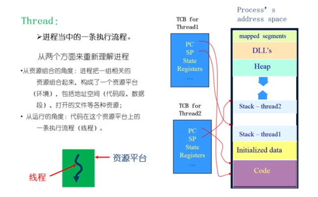
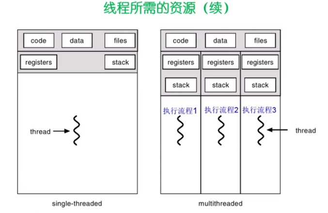
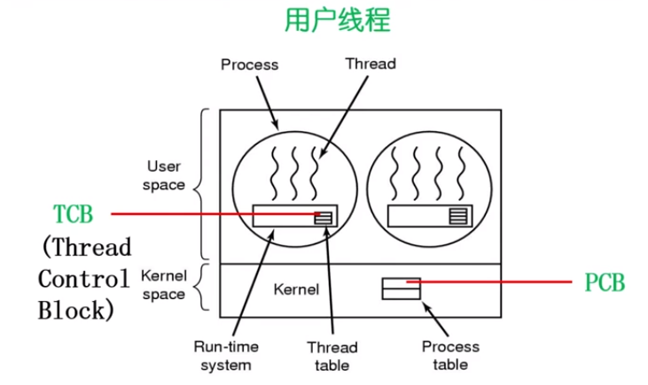

# 线程

## 为什么使用线程

当一个任务我们由几个部分组成，但是我们希望这几个部分可以并发执行。

如果采用多个进程，每个进程处理一个部分，那么如何高效进行进程之间的数据的共享？维护进程的系统开销比较大，创建进程，分配资源，建立 PCB ;撤销进程，回收资源，撤销 PCB; 进程的切换，保存进程的信息

需要提出一种新的实体，满足以下特征：

1.  实体之间可以并发的执行
2. 实体之间共享相同的地址空间

## 什么是线程

> 进程当中的一条执行流程

重新理解进程：

* 从资源组合的角度：进程把一组相关的资源组合起来，构成一个资源平台，包括地址空间（代码段，数据段） 打开的文件等各种资源
* 从运行的角度：代码在这个资源平台上的一条执行流程（线程）

### 线程 = 进程 - 共享资源

线程的优点：

* 一个进程中可以同时存在多个线程
* 各个线程之间可以并发的执行
* 各个线程之间可以共享地址空间和文件资源

线程的缺点：

* 一个线程崩溃，会导致其他所属进程的所有线程崩溃

### 线程所需要的资源

## 进程和线程的比较

* 进程是资源分配单元，线程是 CPU 调度的单位
* 进程拥有一个完整的资源平台，而线程只独享必不可少的资源，如寄存器，栈
* 线程同样具有就绪，阻塞，和执行三种状态，同样具有状态之间的转换关系
* 线程能减少并发执行的事件和空间开销
  * 线程的创建时间比进程短
  * 线程的终止时间比进程短
  * 同一进程内的线程切换时间比进程短（进程的切换需要切换页表，但是同一个进程的线程之间拥有同一个页表，不需要进行切换，页表的切换涉及到一些 Cache 信息，TLB 信息，硬件的信息都需要切换）
  * 由于同一个进程的各个线程之间共享内存和文件资源，可直接通过内存地址进行交换

## 线程的实现

主要有三种线程的实现方式：

用户线程：在用户空间实现

* POSIX Pthreads      Mach C-threads      Solaris    threads

内核线程：在内核中实现

* Windows   Solaris   Linux 

轻量级进程：在内核中实现，支持用户线程

Solaris   (LightWeight Process)

> 操作系统看不到的线程叫做用户线程，由操作系统管理的线程叫做内核线程
>
> 那么用户线程如何管理，它是由用户线程库进行管理

### 用户线程和内核线程的对应关系

* 多对一
* 一对一
* 多对多

### 用户线程

> 用户线程中用户态的库完成了对线程的管理，线程控制块在用户态的库中进行实现，操作系统看不到这些线程，只能看到进程。线程的调度和管理是由线程库进行调度。

> 在用户空间实现的线程机制，它不依赖于操作系统内核，由一组用户级的线程库函数来完成线程的管理，包括进程的创建，终止，同步和调度等。

* 由于用户线程的维护由相应的进程来完成（通过线程库函数），不需要操作系统内核了解用户线程的存在，可用于不支持线程技术的多进程的操作系统
* 每个进程都需要自己的四由的线程控制块(TLB)列表，用来跟踪记录它的各个线程的状态信息（PC, 栈指针，寄存器），TLB 由线程库函数来维护
* 用户线程的切换也是由线程库函数来完成，无需用户态/核心态切换，所以速度特别快
* 允许每一个进程 拥有自己的线程调度算法

#### 用户线程的缺点

* 阻塞性的系统调用如何实现？如果一个线程发起系统调用而阻塞，则整个进程在等待；这个进程下面的线程全部都会被阻塞
* 当一个线程开始运行之后，除非它主动交出 CPU 的使用权，否则它所在的进程当中其他线程无法运行
* 由于时间片分配给进程，故和其他的进程相比，每一个线程得到的时间片较少，执行会比较的慢

### 内核线程

> 是指在操作系统的内核中实现的一种线程机制，由操作系统的内核来完成线程的创建，终止和管理

* 在支持内核线程的操作系统当中，由内核来维护进程和线程的上下文的信息
* 线程的创建，终止和切换都是通过系统调用/类和函数的方式进行，由内核来完成。因此系统的开销较大
* 在一个进程中，如果某个内核线程发起的系统调用而被阻塞，并不影响其他内核线程的运行
* 时间片分配给线程，多线程的进程获得更多的 CPU

## 轻量级进程

它是内核支持的用户线程。一个进程可以有一个或者多个轻量级的进程，**每个轻量级进程有一个单独的内核线程进行支持**

