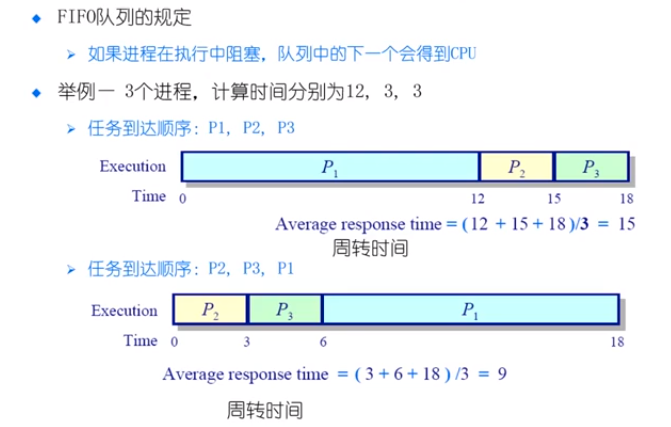
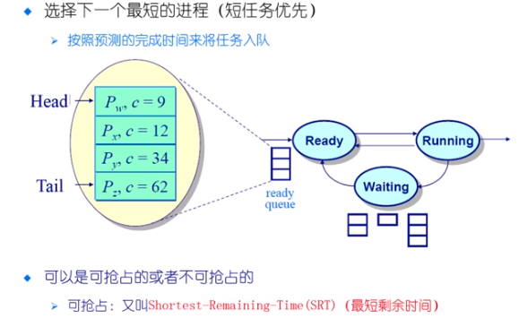
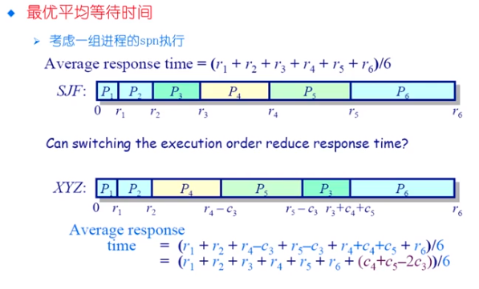
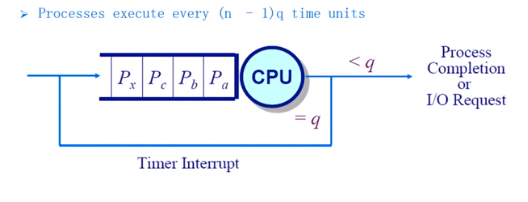
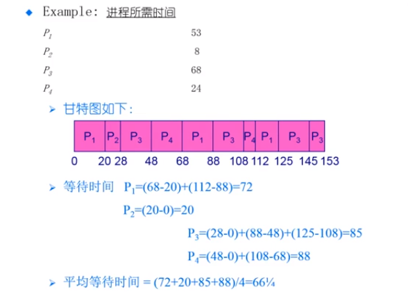
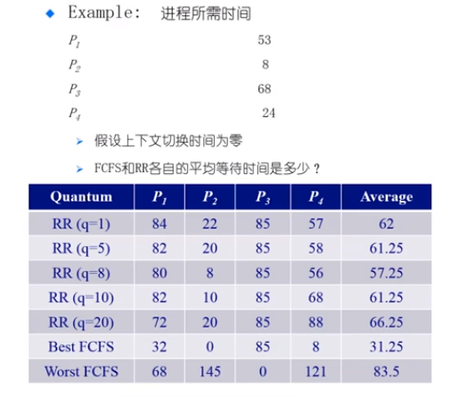
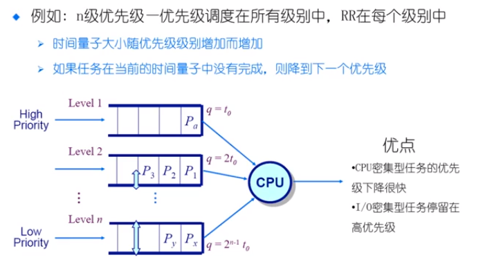

# 调度算法

* FCFS : fist come, fist served 
  * 先来先服务
* SPN(SJF) SRT : shortest Process Next
  * 短进程优先
* HRRN ： Highest Response Ratio Next
  * 最高响应比优先
* Round Robin
  * 轮循。使用时间切片和抢占来轮流执行任务
* MultiLevel Feedback Queues
  * 多级反馈队列  优先级队列中的轮循
* Fair Share Scheduling 
  * 公平共享调度

## FIFO 

* 如果进程在执行的过程中阻塞，队列中的下一个会得到 CPU

> 如果前面的进程执行的时间越长，后面的进程等待的时间也就越长
>
> 这往往会导致平均的周转时间变长

* 优点

  * 简单

* 缺点

  * 平均等待时间的波动很大，平均的周转时间波动也很大
  * 花费时间少的任务可能排在花费时间长的任务的后面
  * 可能导致 I/O 和 CPU 之间的重叠处理
    * CPU 密集型的进程会导致 I/O 设备闲置时，I/O 密集型进程也在等待

  

## 选择下一个最短的进程（短任务优先）SPN

* 按照预测的完成时间来将任务入队
* 可以是可抢占的或者是不可抢占的
  * 可抢占 Shortest-Remaining-Time （SRT） 

> 这种策略可以达到最短平均周转(等待)时间

* 可能导致饥饿
  * 连续的短任务会使得长任务饥饿
* 需要预知未来
  * 怎么估计下一个 CPU 突发的持续时间
  * 简单的解决方法 ： 询问用户
  * 如果用户欺骗就杀死进程
  * 如果用户不知道怎么办

> 如何估计进程的执行时间？

## 最高响应比优先 HRRN

* 在 SPN 调度的基础上改进
* 不可抢占
* 关注进程等待了多长的时间
* 防止无限期推迟

$$
\bold{R} = \frac{w+s}{s}
$$

w : 表示等待时间

s : 表示已经等待时间

## Round Robin

以时间切片的离散单元中分配处理器

时间片结束，切换到下一个准备好的进程

### example

* 额外的上下文的切换
* 时间切片过大
  * 等待时间过长
  * 极限情况下退化为 FCFS
* 时间切片太小
  * 反映迅速，但是....
  * 吞吐量由于大量的上下文的切换受到影响
* 目标：
  * 选择一个合适的时间切片的大小
  * 经验规则：维持上下文切换开销控制在 1% 以内

### example

## 多级队列

* 就绪队列被划分为独立的队列

  * 例如 ： 前台（交互），后台 (批处理)

* 每一个队列拥有自己的调度算法

  * 例如 ： 前台 -- Roud Robin ,后台 --- FCFS

* 调度必须在队列间进行

  * 固定优先级
    * 先处理前台，然后处理后台
    * 可能导致饥饿
  * 时间切片
    * 每一个队列都得到一个确定的能够调度其进程的 CPU 总时间
    * 例子 ： 80% 给 使用 Round Robin 的前台任务， 20% 给使用 FCFS 的后台任务

  > 一个进程可能一段时间执行的是CPU 密集的前台任务，有可能在另一段时间是一个 IO密集的 后台任务，那么如何进行调度

## 多级反馈队列

* 一个进程可以在不同的队列中进行移动

## example

我们希望交互性比较强的任务（I/O）可以很快的得到执行，CPU 密集型的任务我们放在优先级比较低的地方（因为不着急获取它的结果）

## 公平共享调度 FSS 

> 面向服务器的，面向科学计算的服务器可能同时有多个用户来使用这个服务器。我们不会在进程的级别来实现公平，我们希望可以在用户的级别做到对 CPU 的资源的公平的调用

例如  Linux  CFS

> 上面的调度算法和实际操作系统中的调度算法还是有很大的差别的，但是上面的算法的思路在现代操作系统当中都有体现

