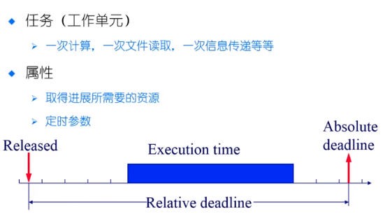
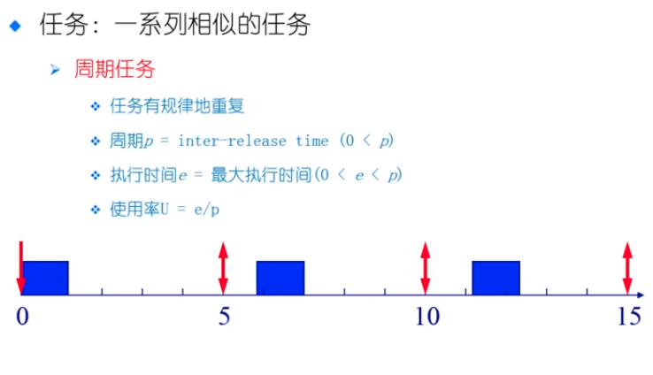

# 实时调度

> realtime System : 在工业控制，交通等领域我们需要某些任务必须在某些特定的时间进行执行，不能有任何的错误

* 强实时系统
  * 需要在规定的时间内完成重要的任务，必须完成（没有完成可能造成严重的后果）
  * 例如：水坝的开关闸门
* 弱实时系统
  * 要求重要的进程的优先级更高，尽量完成，并非必须

### 具体的例子

硬时限

* 错过最后时限，后果严重
* 必须验证：在最坏情况下是否满足时限
* 保证正确性

软时限

* 理想情况下，时限应当被最大满足。如果时限没有被满足，那么就响应的降低要求
* 尽最大努力去保证

静态优先级调度

* 在任务执行之前，任务的优先级已经确定了，操作系统根据优先级来选择任务，在规定的时间内进行执行

动态优先级调度

* 任务的优先级随着执行的过程，优先级会动态的变化 

## 实时系统中的调度算法

### RM （Rate Monotonie） 速率单调调度

* 最佳静态优先级调度
* 通过周期安排优先级
* 周期越短优先级越高
* 执行周期最短的任务

### EDF (Earliest Deadline First) 最早期限调度

* 最佳的动态优先级调度
* DeadLine 越早优先级越高
* 执行 DeadLine 最早的任务

