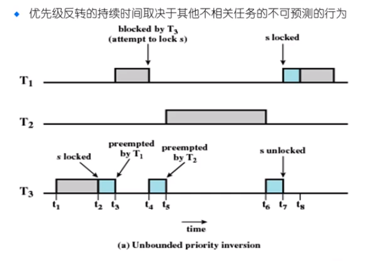
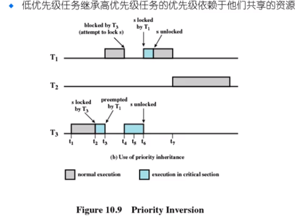

# 多处理器调度与优先级反转

多处理器的 CPU 调度更加的复杂

* 多个相同的单处理器组成一个多处理器
* 优点：负载共享

对称多处理器（SMP）

* 每一个处理器运行自己的调度程序
* 需要在调度程序中同步

> 进程放在哪个 CPU 上进行执行？
>
> 如何保障不会出现一些CPU 忙，另一些CPU空闲的问题？（负载平衡）

> 一个 CPU 内部的调度和前面介绍的通用调度的方法相似，但是每一个 CPU 需要去查看其他 CPU 的负载情况，来调整自己的调度情况

## 优先级反转问题

* 可以发生在任何基于优先级的可抢占的调度机制中
* 当系统内的环境强制使高优先级任务等待低优先级任务时发生

### 例子

操作系统中有三个优先级的进程，优先级的排序为  ${T_1 > T_2 > T_3}$ 。考虑图中的时间执行：

> 首先 $T_3$ 最先进行执行，它从 $t_1$ 时刻执行到 $t_2$ 时刻，在 $t_2$ 时刻获取到了一个公共资源 $s$ 的锁，并一直执行到 $t_3$ 时刻，这个时候，高优先级的 $T_1$ 任务到达，因此，$T_3$ 让出 CPU 的执行，$T_1$ 任务开始执行。但是 $T_1$ 执行到 $t_4$ 时刻的时候，想要访问公共资源 $s$ ，但是这个资源目前被 $T_3$ 所持有，因此 $T_1$ 不得不让出 CPU 的执行控制权

> $T_3$ 得以再次从 $t_4$ 执行到 $t_5$ 。此时第二高优先级的进程 $T_2$ 到达，操作系统转而去执行 $T_2$ ,它一只执行到 $t_6$ 时刻结束，$T_3$ 继续执行到 $t_7$ 结束，释放公共资源 $s$ ,此时 $T_1$ 获取到公共资源，开始执行

问题： 虽然 $T_1$ 的优先级比 $T_2$ 高，但是 $T_1$ 却没有办法进行执行，**它的执行受制于 $T_2$ 的执行（$T_1$ 受制于 $T_3$ 控制的公共资源，$T_3$ 又受制于 $T_2$ 的执行**）。这种现象就是一个高优先级的进程等待低优先级的进程的现象

### 解决方法

1. 优先级继承方法：$T_3$ 访问了共享资源，如果 $T_1$ 也需要访问共享资源，那么此时我们将 $T_3$ 的优先级提高到和 $T_1$ 相同的优先级，那么这个时候，$T_2$ 就没有办法打断 $T_3$ 的执行过程

2. 优先级天花板协议：“资源”的优先级和 "所有使用这个资源的任务中优先级最高的哪个任务的优先级"相同。当一个认为访问一个资源的时候，**这个任务的优先级就会得到提升，提升到和这个资源的优先级相同**，其他的进程除非其优先级会超过这个资源的优先级，否则的话，就需要等待

