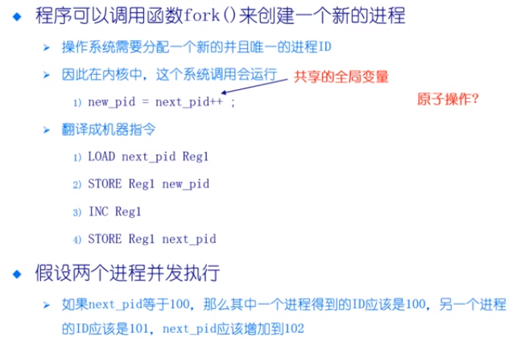
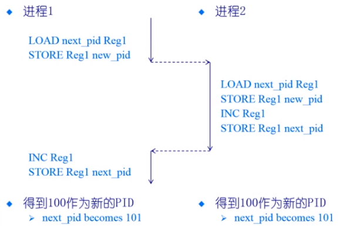
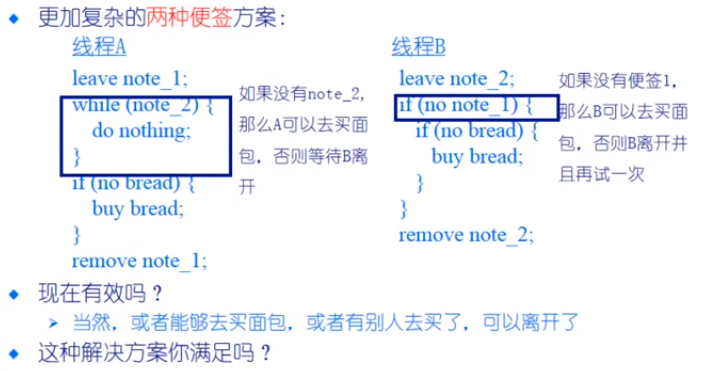

# 同步

> 多个进程和线程之间需要进行交互，涉及到对共享资源的访问过程，如果没有一种同步的手段，那么就会出现各种问题
>
> 如果进程和线程之间不需要进行交互，那么进程和线程的执行就是确定性的

独立的线程

* 不和其他的线程共享资源
* 确定性
* 可重现
* 调度顺序不重要

合作线程

* 在多个线程中可以共享状态
* 不确定性
* 不可重现

> 不确定性和不可重现意味着 bug 可能时间歇性发生的

> 交互和共享是必须的，带来的好处大于坏处

## 进程交互的例子

如果上面的过程中存在**上下文的切换**，可能存在下面的问题：

> 上下文的切换的过程会保留上下文，包括 CPU 寄存器的值
>
> 上下文的切换可能在任何一条指令之后发生，存在不确定性（不同位置的上下文切换，最终的结果各不相同）

## Race Condition (竞态条件)

系统缺陷 ： 结果依赖于并发值性或者事件的顺序/时间

* 不可确定性
* 不可重现

如何避免竞态？

* 让多条执行的指令不会被打断

## Atomic (原子操作)

原子操作是一次不存在任何中断或者失败的执行

* 执行成功结束
* 或者根本不执行
* 执行的中间状态不能被其他进程进行读取

## Critical Section (临界区)

临界区是指进程中的一段需要访问共享资源并且当另一个进程处于相应代码区域时便不会被执行的代码区域

## Mutual Exclusion （互斥）

当一个进程处于临界区并访问共享资源的时候，**没有其他进程会处于临界区并且访问任何相同的共享资源**

## Dead Lock (死锁)

出现了进程/线程**相互等待对方完成特定的任务**，而最终处于可执行状态却得不到执行

## Starvation （饥饿）

一个可执行的进程，被调度器持续忽略，以至于虽然处在可执行的状态但是得不到执行

### 一个可以实现两个线程之间互斥的方法

> 两个线程完成同一个任务，但是实现的逻辑不相同
>
> 其中一个线程会有空运行的情况（这种状态被称之为 “忙等待”）
>
> 有超过两个线程需要完成这个任务，这种方法就不管用了

## 临界区

* 互斥：同一时间临界区最多存在一个线程
* Progress : 如果一个线程想要进入临界区，那么它最终会成功
* 有限等待：如果一个线程处在入口的地方，那么这个线程的请求被接收之前，其他的线程在临界区内的时间时有限的
* 无忙等待：如果一个进程在等待进入临界区，那么它可以在临界区外进行挂起
  * 如果等待的时间非常的短，可以进行忙等（效率更高）

